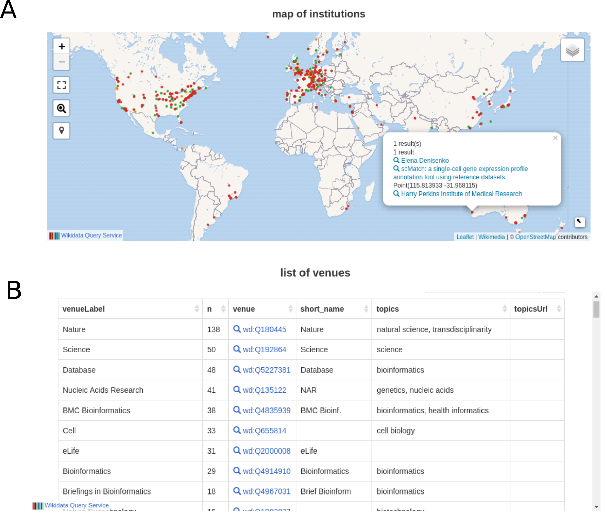

## Wikidata Bib and a professional system for biocuration

### Introduction 

* Accountants have Double-entry bookkeeping (https://en.wikipedia.org/wiki/Double-entry_bookkeeping), software developers have Test-driven development (https://en.wikipedia.org/wiki/Test-driven_development).

* Develop a professional way for coverage of large-scale revisions, inspired by Umberto Eco's How to Write a Thesis [@wikidata:Q3684178] adapted to the digital environment, using version-control and semantic links. 

* Connect the reading framework with a Biocuration strategy to feed knowledge to Wikidata

## Wikidata Bib as a reading system 

It consists of a set of Python scripts and a standard file structure. 
A file contains the list of articles to be read in markdown. Articles are represented as Wikidata QIDs which enables automatic information retrieval from Wikidata's structured systems.  
Articles were organized in 2 main sections, one for cell-type related articles and one for biocuration-related articles. 

* __Show file structure__

The Wikidata Bib system has a "pop" function, which creates a personalized note document in markdown for the first article of a section and (if possible) obtains the full text article from Unpaywall (https://unpaywall.org/). 
The note document contains a space for highlights, which can be copied from the original text and pasted in the markdown file.

* __image pop__

Notes and additional information are saved in a GitHub repository, and the structured information powers a live website with analytics on the users recent readings. 
The source code for Wikidata Bib is available at https://github.com/lubianat/wikidata_bib/tree/template and notes on my readings can currently be accessed at https://lubianat.github.io/wikidata_bib/.

{#fig:notetaking}

- _Talk about Author Disambiguator and other contributions_

Besides the technical aspects of Wikidata Bib, the organized reading methodology included a discipline step of continued reading, with a target of 1-2 papers per section per day.
Based on Umberto Eco's suggestion on How to Write a Thesis [@wikidata:Q3684178] to develop a careful indexing system for literature, an index document was constructed containing the topics of interest for writing the thesis. 
The topics were added as plain text in the personalized note documents, allowing batch retrieval of articles of interest via the command line, using `grep` (https://en.wikipedia.org/w/index.php?title=Grep&oldid=1039541979).  

* __image grep and open__

## Wikidata Bib as a dashboard 

* Wikidata Bib generates real-time, public visualizations of my literature progress

* wbib package: https://github.com/lubianat/wbib

{#fig:dashboard}

* _Wikidata Bib reading status_:
    - articles read
    - authors read 

## Wikidata Bib for curation of cells to Wikidata

* Recording of cell types in Google Spreadsheets

* Integration to Wikidata via Python script

* Figure @fig:biocuration_of_cells

{#fig:biocuration_of_cells width="85%"}

### Results 

* Update the status via <https://colab.research.google.com/drive/1GvQXOs51_U8icdGMtKXMeLOXKM8pXWet#scrollTo=szvBWI9zr_AA>

Wikidata statistics on cell types
2625 total cell classes
More than the Cell Ontology
519 human-specific cell classes 
277 mouse-specific cell classes 

User:TiagoLubiana: 
At least 1 edit in 2495 cell classes
Created 1395 cell classes

{#fig:subclass_of_cell width="85%"}

