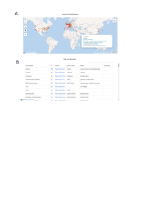
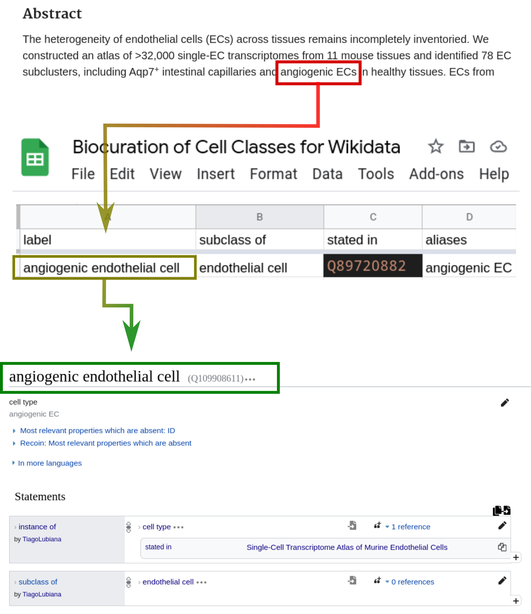

## Wikidata Bib and a professional system for biocuration {.page_break_before}

### Introduction 

Reading scientific articles is an integral part of the routine of modern scientists.
Although several literature-management software are available [@url:https://en.wikipedia.org/wiki/Comparison_of_reference_management_software], the process of reading is mainly artisanal. 
There are no standard guidelines on how to probe the literature organize notes for biomedical researchers. 
Thus, while reading and studying is a core activity, there are few (if any) protocols for the efficient screening of scientific articles. 

Other professional traditions have dealt with similar issues in the past. 
Notetaking is vital to keep track of financial balances and avoid costly problems in accounting.
Double-entry bookkeeping was developed in the 13th century as a professional solution for notetaking in accounting where "every entry to an account requires a corresponding and opposite entry to a different account." [@url:https://en.wikipedia.org/w/index.php?title=Double-entry_bookkeeping&oldid=1055066428]
In software development, Test-Driven Development (TDD) is a popular methodology where tests for code snippets are written before the code itself, therefore ensuring that written software passes minimum quality standards.
The similarities of Double-entry bookkeeping and TDD are diverse [@url:https://blog.cleancoder.com/uncle-bob/2017/12/18/Excuses.html], but for our purpose, here suffices to see both as professionalized systems that promote better quality and accountability of works. 


In the humanities, there is a well-established practice of annotations of readings. 
The annotation skills are part of standard academic training in the humanities [@url:https://bibliotecadaeca.wordpress.com/2019/09/30/como-fazer-um-fichamento][@url:"https://www.youtube.com/playlist?list=PLAudUnJeNg4vWJhEJ_da26C-QW5qiS7uZ"]. 
An influential work in presenting methods for academic reading in the humanities is Umberto Eco's book "How to Write a Thesis" [@wikidata:Q3684178], which outlines not only _how_ to annotate the literature that basis an academic thesis, but also _why_ to do so. 
The book, written originally in 1977, is still influential today. 
Still, its theoretical scope (roughly the humanities) and its date preceding the digital era limits the extent to which it applies to the biomedical sciences. 


Notably, the need for an organized reading system for biocuration studies stems from a difference in methodology. 
In humanities, the main (if not sole) research material is the written text, the books and articles from which research stems—[@url:"https://www.youtube.com/playlist?list=PLAudUnJeNg4vWJhEJ_da26C-QW5qiS7uZ"].
In the biomedical sciences, including a large part of bioinformatics, the object of study is the natural world, observed via experimentation. 
Thus, naturally, scientific training focuses on experimentation and data analysis's theoretical and practical basis. 
With the boom of scientific articles, however, the scientific literature (and accompanying public datasets) already provide a strong material for sculpting scientific projects.
Thus, developing a methodology for academic reading tailored to the digital environment is a need. 

This chapter concerns itself with presenting Wikidata Bib, a framework for large scale reading of scientific articles. 
It is presented in three parts, each with a technical overview alongside the theoretical foundations. 
First, Wikidata Bib is presented as a reading system for managing references and notes using a GitHub repository and plain text notes.
Then, we present how the system ensures accountability, allowing users to get personalized analytics on their reading patterns.
Finally, we demonstrate how Wikidata Bib fits an active curation environment, connecting the framework with the larger goal of this project of curating information about cell types on Wikidata.  

## Wikidata Bib as a reading system 

The reading framework of Wikidata bib is built upon a git repository integrated with GitHub, Python3 scripts and SPARQL queries. 
It has a standard file structure, summarized as the following:

* `docs/`
    * `index.html`
* `downloads/`
    * `10.7554_ELIFE.52614.pdf`
* `notes/`
    * `Q87830400.md`
* `src/`
    * `get_pdf.py`
    * `helper.py`
    * `read_paper.py`
    * `update_dashboard.py`
* `index.md`
* `toread.md`
* `config.yaml`
* `pop`
* `wadd`
* `wadd_all`
* `wread`
* `wlog`

The `docs/` directory contains the live dashboard from the readings, which will be discussed in the following sessions.
The `downloads/` directory hosts the pdfs of the articles read with the system. 
These are not committed to the repository and are only stored locally. 
The `notes/` directory contains markdown files, one for each article read. 
The `src/` directory contains the python code with the system's mechanics. 
They contain helper functions for the command line commands discussed below:
    - `wread` which receives a Wikidata QID for an article and outputs (1) a notes document, (2) a pdf for the paper obtained from Unpaywall [@url:https://unpaywall.org] and (3) an updated version of the dashboard HTML files in the `docs/` directory.
    - `pop`, which "pops" an article from `toread.md` and runs `wread` for it
    - `wadd`, which takes an URL for a Wikidata SPARQL query and adds new QIDs to `toread.md`
    - `wadd_all`, which parses `config.yaml` for recurrent SPARQL queries and runs `wadd` for each
    - `wlog`, which adds, commits and pushes recent readings and dashboard updates to GitHub

All the structures described so far are commonly shared by any user of Wikidata Bib. 
To personalize the use of the system, the user edits three plain text files.
`toread.md` hosts plain text QIDs of the articles that will be read. 
These can be added either manually or via wadd.
While the `pop` command only sees QIDs, articles titles or other identifiers can temporarily be added to `toread.md` without breaking the system. 
`index.md` hosts a numbered list of topics of interest.
This file plays the role of  Umberto Eco's work plan, with the topics of interest for the academic. [@wikidata:Q3684178]
These are used to tag articles for retrieval in a later step. 
`config.yaml` contains shortcuts for different reading lists. 
This is better explained by example. 
In my `to read.md` file there are two reading lists, one following a `# Cell types` header and another following a `# Biocuration` header. 
My `config.yaml` contains the following snippet: 
```yaml
lists:
# - shortcut: Title of header in toread.md  
  ct: Cell types
  bioc: Biocuration
```
The `config.yaml` shortcuts are used as arguments by the `pop` command, where `$ ./pop ct` retrieves an article from the "Cell types" list, while `$ ./pop bioc` retrieves an article from the "Biocuration" list.  

The Wikidata bib framework is coupled with a discipline of daily reading.
The discipline is inspired by Robert Cecil Martin's description of Test Driven Development in the book "Clean Code", which includes not only a technical description but a _school of thought_ of how software development might be approached.  [@wikidata:Q109996684]
Every day, I read one article of each list, using the notetaking station displayed in Figure @fig: notetaking.
The constancy of reading allows steady coverage of the relevant literature. 
While the discipline has worked for this research project, it is not required to use the Wikidata Bib system.

The notetaking station of Wikidata Bib, opened in Virtual Studio Code, is depicted on Figure @fig: notetaking A.
The title and publication dates are displayed, and the reading process entails copying snippets from the text to the "Highlights" session. 
Copying the highlights into plain text makes the sections of interest searchable via command line using `grep` (https://en.wikipedia.org/w/index.php?title=Grep&oldid=1039541979).
Comments can be added either in the comment section or inline, alongside the highlights, using ` --> Comment goes here ` to differentiate from highlights.
Also searchable by `grep` are the tags, copied and pasted from `index.md` in the `## Tags` session or alongside the main article. 


The discipline also includes, whenever possible, an improvement of the metadata about the article on Wikidata. 
In @fig: notetaking B are shown the links included in the dashboard. 
A link to a Scholia [@wikidata:Q41799194] profile allows identification of related articles from a series of pre-made SPARQL queries probing bibliography data on Wikidata.
While Scholia provides an overview of a given article, it does not allow direct curation of the metadata.
For that, two links are provided, one to Wikidata and one to Author Disambiguator [@url:https://www.wikidata.org/wiki/Wikidata:Tools/Author_Disambiguator].
By accessing the Wikidata page for the entity, one can add new triples, for example, curating authors and topics of the article, which are then used by Scholia and by Wikidata Bib's dashboard. 
Author Disambiguator is a wrapper of an Wikimedia API that facilitates disambiguating author names to unique identifiers on Wikidata, thus feeding the public knowledge graph of publication and authors.  
Finally, a link to the article's DOI or full-text URL is provided and serves as a fallback when the automatic download fails. 
Of note, while the metadata curation has a technical benefit to Wikidata and the dashboard, it also plays a theoretical role. 
By curating metadata on authors, the user of Wikidata Bib can better understand the people they read, and expand their metascientific perspective on their domain of interest. 

{#fig:notetaking}

The source code for Wikidata Bib is available at <https://github.com/lubianat/wikidata_bib>. 


## Wikidata Bib as a dashboard 

The Wikidata Bib system also enables the reader to get statistics on their readings. 
Two simple databases are stored on the GitHub repository:
 * `read.ttl` - An RDF document recording the dates in which each article was read. 
 * `read.csv` - An simple, human-readable index connecting QIDs with article titles. 
The CSV file is only stored for accountability and as a quick way to glance at the titles read. 
The .ttl file, on the other hand, is processed by the `update_dashboard.py` script to render 4 different HTML files under the `docs/` folder: 
 - `index.html`
 - `last_day.html`
 - `past_week.html`
 - `past_month.html`
All files are displayed in a GitHub pages. 
In the case of this work, they are displayed at <https://lubianat.github.io/wikidata_bib/>. 

To organize the code for rendering the dashboard, we created a python package, wbib, and deposited it in PyPi, making it available via `pip`. [@url:https://pypi.org/project/wbib].
The package implements the logic for rendering complex Wikidata-based academic dashboards and is available in GitHub at <https://github.com/lubianat/wbib>. 
It allows the user to build dashboards based on Wikidata records of information such as gender of authors, the region of author's institutions, topics of articles and similar metascientific information. 
The dashboard is composed of SPARQL queries written for the Wikidata Query Service [@url:https://query.wikidata.org] 
It also allows users to feed an arbitrary list of articles and obtain a custom dashboard. 
Wikidata Bib obtains the HTML dashboards after feeding wbib the lists of articles read in total (`index.html`) or in pre-determined time spans (`last_day.html`, `past_week.html` and `past_month.html` )


{#fig:dashboard width="85%"}

The dashboard includes not only a basic list of read articles, but also statistics on most read authors and most-read venues. 
It also displays an interactive map of the institutions of articles read, permitting a glance at geographic biases in activities. 
An example of queries is shown in @fig:dashboard.
As the queries are rendered live, they evolve in quality with the growth of Wikidata. 
Finally, the clean 5-star-open data format enables users to adapt the queries to include different aspects of Wikidata. 
For example, table @tbl:articles_read_hca showcases 10 articles that (1) I have read in the past year and (2) were authored by a speaker of the 1st Human Cell Atlas Latin America Single Cell RNA-seqData Analysis Workshop [@url:https://www.humancellatlas.org/hca-latin-america-2021-workshop]. 
One practical application that the dashboard enables, thus, is to identify people in an event, institution or location that the user has read before, therefore catalyzing the possibility of collaborations. 
Anecdotally, this strategy was tested successfully at Biohackathon Europe 2021 [@url:https://biohackathon-europe.org], where I used the system both to identify possible collaborators and as a conversation starter. 

|workLabel                                                                                        |authors                                                                   |
|-------------------------------------------------------------------------------------------------|--------------------------------------------------------------------------|
|A promoter-level mammalian expression atlas                                                      |Jay W Shin                                                                |
|Single-cell RNA-seq reveals new types of human blood dendritic cells, monocytes, and progenitors.|Muzlifah Haniffa                                                          |
|The Human Cell Atlas.                                                                            |Musa Mhlanga, Jay W Shin, Muzlifah Haniffa, Menna R Clatworthy, Dana Pe'er|
|The Human Cell Atlas: Technical approaches and challenges.                                       |Jay W Shin                                                                |
|Innate Immune Landscape in Early Lung Adenocarcinoma by Paired Single-Cell Analyses.             |Dana Pe'er |
|Single cell RNA sequencing of human liver reveals distinct intrahepatic macrophage populations   |Sonya A MacParland                                                        |
|Single-cell reconstruction of the early maternal-fetal interface in humans                       |Muzlifah Haniffa                                                          |
|Distinct microbial and immune niches of the human colon                                          |Rasa Elmentaite, Menna R Clatworthy                                       |
|A cell atlas of human thymic development defines T cell repertoire formation                     |Muzlifah Haniffa, Menna R Clatworthy                                      |
|Decoding human fetal liver haematopoiesis                                                        |Muzlifah Haniffa                                                          |

Table: Articles read by Tiago Lubiana before 8 December 2021 in which an author was a speaker at HCA Latin America
{#tbl:articles_read_hca}                                                        |

## Wikidata Bib for curation of cells to Wikidata

The Wikidata Bib system was devised originally to allow an overview of the fields of cell classification and biocuration. 
However, during the process, it was also repurposed for biocuration of new cell classes in Wikidata.
By fast-tracking the reading of new articles, Wikidata Bib enables an efficient parsing of the literature and, thus, the identification of previously uncatalogued cell types. 

Articles read with Wikidata Bib were screened to mention cell types absent from Wikidata. 
As discussed in the chapter about the concept of cell type, we considered a "cell type" as any class of cells described by a domain expert with evidence of the reality of its instances.
When a mention of such a class appears in an article, I first verify Wikidata for the existence of a related class. 
If it is absent from the platform, I enter a class name, alongside a superclass, and a QID in a Google Spreadsheet, as shown in Figure @fig:biocuration_of_cells.

The information from the spreadsheet is pulled by a python script and processed locally with a series of dictionaries that match common terms to Wikidata IDs. 
In the example shown in Figure @fig:biocuration_of_cells, the string "endothelial cell" was matched against a manually curated dictionary to the Wikidata entry [Q11394395](https://www.wikidata.org/wiki/Q11394395), the representation of that concept on Wikidata. 
After reconciling the data, the script uses the Wikidata Integrator python package [@url:https://github.com/SuLab/WikidataIntegrator] to insert the new entries on the Wikidata database. 
The code for integrating a Google Spreadsheet to Wikidata is available at <https://github.com/lubianat/wikidata_cell_curation>. 

{#fig:biocuration_of_cells width="85%"}


Wikidata contains 2940 subclasses of "cell ([Q7868](https://www.wikidata.org/wiki/Q7868))" as of 8 December 2021. 
From those, 550 cell classes are specific for humans, and 318 are specific for mice.  
As a comparison, as of 8 December 2021, Wikidata has more cell classes than the Cell Ontology, which lists 2577 classes. 
It is worth noticing that classes on the Cell Ontology are added after careful consideration by ontologists and domain experts and should be considered of higher quality than the ones on Wikidata. 


From the 2940 cell classes on Wikidata, 2812 (95.6%) have been edited somehow by User:TiagoLubiana, and 1668 (56.7%) have been created by User:TiagoLubiana. 
Edits made to the cells were often connecting a dangling term, created automatically from an Wikipedia page to the cell subclass hierarchy, and included adding identifiers, images, markers, and other pieces of information. 
From the 1668 entities created, approximately 63 species-neutral cell types, 188 human and 188 mouse cell types were added based on PanglaoDB entries (total of 439).
The remaining 1229 entries were created either via Wikidata's web interface or via the curation workflow described in this chapter. 
These statistics are a simple demonstration of how the curation system efficiently contributes to the status of cell type information on Wikidata. 
