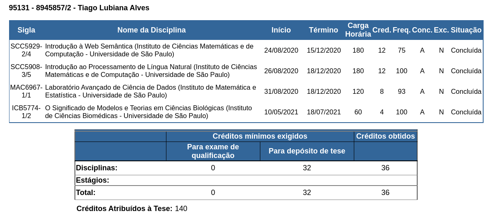

# Additional Work

## Collaborations and manuscripts

### fcoex 

During the initial course of this PhD work, we also completed the development and reporting of _fcoex_, an R package for investigating cellular phenotypes using co-expression networks. [@url:https://www.bioconductor.org/packages/release/bioc/html/fcoex.html] The software was maintained to withstand new releases of dependencies and new R version and was published as a preprint on biorxiv. [@doi:10.1101/2021.12.07.471603v1]
 
### Wikidata Bots

Alongside the editing of cell-type information on Wikidata, I have joined different efforts to improve biological information on Wikidata.
I have collaborated with the ComplexPortal curators as part of the Virtual Elixir BioHackathon 2020 (https://github.com/virtual-biohackathons/covid-19-bh20/wiki) and for the following year, to build a Wikidata Bot to integrate information on protein complexes to Wikidata. An overview of the Wikidata integration is in Figure @fig:complexportal, presented in an article published in Nucleic Acid Research (re-use of the image and legend possible under the CC-BY license of the article). [@wikidata:Q109348309]
{#fig:complexportal}

I have also collaborated with the Cellosaurus database [@wikidata:Q54370168] to revive the CellosaurusBot [@url:https://www.wikidata.org/wiki/User:CellosaurusBot], responsible for updating the metadata on more than 100,000 cell lines on Wikidata. The bot code, written in Python, was refactored entirely and runs semi-automatically after the Cellosaurus database was released. A write-up of the integration is in progress and is planned for release/submission in the first semester of 2022. 

### Systematic Reviews and publishing of intermediary tables

Finally, in collaboration with Olavo Amaral and Kleber Neves, from the Brazilian Reproducibility Initiative [@wikidata:Q61799268] I wrote a commentary on the value of publishing intermediate datasets as citable products. [@url:https://osf.io/preprints/metaarxiv/vbwa9/] 
The pieces discuss the value of small curations done both in systematic reviews and by experimentalists in the course of their research projects. Published curation tables can serve as a source for improving the ecosystem of open knowledge, not less by reconciliation to Wikidata (thereby bridging the commentary with this project)

### WiseCube - enterprise biomedical question and answering

During a part of this project, I have worked part-time as a consultant for the Wisecube company, based in Seattle, United States. [@url:https://www.wisecube.ai/]
The job was approved by FAPESP and consisted mainly in writing SPARQL queries that probe Wikidata for answers to the questions posed by the BioASQ competition. [@wikidata:Q28646342]
It also entails on-demand curation of biomedical topics on Wikidata based on requests by pharmaceutical companies as well as the development of dashboards targeted at providing insights to customers. 

## Awards and participation in events

During the initial course of this PhD project, I have participated in several events: 

* (Feb-2021) Presented an open talk at the "Semana da Bioinformática" event  about modelling of biological systems (1020 views as of December 2021) [@url:https://www.youtube.com/watch?v=VDvCxskIGEI]
* (Jun-Aug 2021) Helped to organize the No-Budget-Science HackWeek virtual hackathon [@url:https://www.reprodutibilidade.bio.br/hack-week-2021]
* (Jul - 2021) Presented the work "Wikidata for 5-star Linked Open Databases: A case study of PanglaoDB" at the Bio-Ontologies section of the Annual International Conference on Intelligent Systems for Molecular Biology. [@doi:10.5281/zenodo.5747849]. The presentation was awarded the best
* (Jul - 2021) Awarded the 2nd place in the International Society for Computational Biology (ISCB) Wikipedia Competition for the contributions to the Wikipedia page on Biocuration (<https://en.wikipedia.org/wiki/Biocuration>) [@url:https://en.wikipedia.org/wiki/Biocuration]
* (Nov - 2021) Managed a project during BioHackathon Europe 2021, in Barcelona, Spain, on the representation of ELIXIR information on Wikidata. [@url:https://github.com/elixir-europe/biohackathon-projects-2021/tree/main/projects/32]

## Course work

During the first year of the PhD program, I took four different classes, acquiring 36 academic credits. 
Figure @fig:courses_taken displays the disciplines taken, available only in Portuguese. 
 
{#fig:courses_taken}