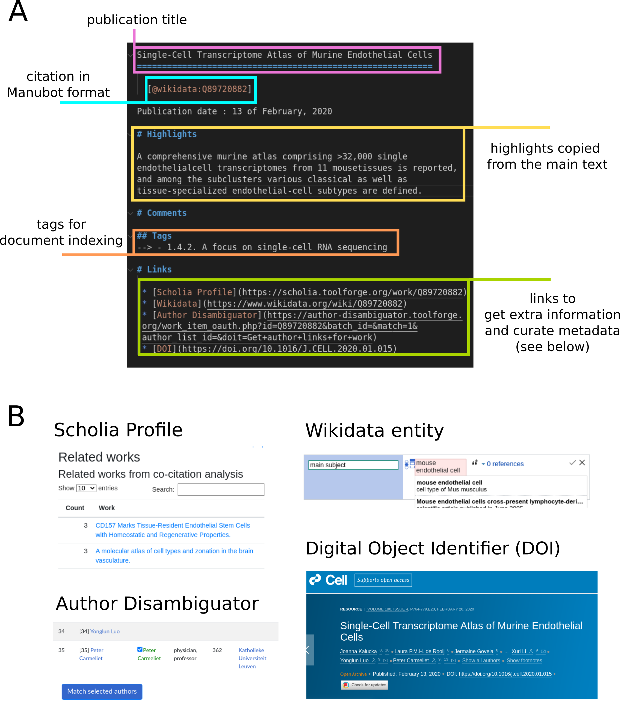
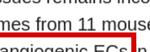

---
title: Building a biological knowledge graph via Wikidata with a focus on the Human Cell Atlas
keywords:
- Wikidata
- Human Cell Atlas
- ontology
- Cell Ontology
lang: en-US
date-meta: '2021-12-10'
author-meta:
- Tiago Lubiana
header-includes: |-
  <!--
  Manubot generated metadata rendered from header-includes-template.html.
  Suggest improvements at https://github.com/manubot/manubot/blob/main/manubot/process/header-includes-template.html
  -->
  <meta name="dc.format" content="text/html" />
  <meta name="dc.title" content="Building a biological knowledge graph via Wikidata with a focus on the Human Cell Atlas" />
  <meta name="citation_title" content="Building a biological knowledge graph via Wikidata with a focus on the Human Cell Atlas" />
  <meta property="og:title" content="Building a biological knowledge graph via Wikidata with a focus on the Human Cell Atlas" />
  <meta property="twitter:title" content="Building a biological knowledge graph via Wikidata with a focus on the Human Cell Atlas" />
  <meta name="dc.date" content="2021-12-10" />
  <meta name="citation_publication_date" content="2021-12-10" />
  <meta name="dc.language" content="en-US" />
  <meta name="citation_language" content="en-US" />
  <meta name="dc.relation.ispartof" content="Manubot" />
  <meta name="dc.publisher" content="Manubot" />
  <meta name="citation_journal_title" content="Manubot" />
  <meta name="citation_technical_report_institution" content="Manubot" />
  <meta name="citation_author" content="Tiago Lubiana" />
  <meta name="citation_author_institution" content="School of Pharmaceutical Sciences, University of São Paulo" />
  <meta name="citation_author_institution" content="Ronin Institute" />
  <meta name="citation_author_orcid" content="0000-0003-2473-2313" />
  <meta name="twitter:creator" content="@lubianat" />
  <link rel="canonical" href="https://lubianat.github.io/quali_phd/" />
  <meta property="og:url" content="https://lubianat.github.io/quali_phd/" />
  <meta property="twitter:url" content="https://lubianat.github.io/quali_phd/" />
  <meta name="citation_fulltext_html_url" content="https://lubianat.github.io/quali_phd/" />
  <meta name="citation_pdf_url" content="https://lubianat.github.io/quali_phd/manuscript.pdf" />
  <link rel="alternate" type="application/pdf" href="https://lubianat.github.io/quali_phd/manuscript.pdf" />
  <link rel="alternate" type="text/html" href="https://lubianat.github.io/quali_phd/v/cf629fe1f70f8f676f43e4ec04950c65a9674e6f/" />
  <meta name="manubot_html_url_versioned" content="https://lubianat.github.io/quali_phd/v/cf629fe1f70f8f676f43e4ec04950c65a9674e6f/" />
  <meta name="manubot_pdf_url_versioned" content="https://lubianat.github.io/quali_phd/v/cf629fe1f70f8f676f43e4ec04950c65a9674e6f/manuscript.pdf" />
  <meta property="og:type" content="article" />
  <meta property="twitter:card" content="summary_large_image" />
  <link rel="icon" type="image/png" sizes="192x192" href="https://manubot.org/favicon-192x192.png" />
  <link rel="mask-icon" href="https://manubot.org/safari-pinned-tab.svg" color="#ad1457" />
  <meta name="theme-color" content="#ad1457" />
  <!-- end Manubot generated metadata -->
bibliography:
- content/manual-references.json
manubot-output-bibliography: output/references.json
manubot-output-citekeys: output/citations.tsv
manubot-requests-cache-path: ci/cache/requests-cache
manubot-clear-requests-cache: false
...


<small><em>
This manuscript
([permalink](https://lubianat.github.io/quali_phd/v/cf629fe1f70f8f676f43e4ec04950c65a9674e6f/))
was automatically generated
from [lubianat/quali_phd@cf629fe](https://github.com/lubianat/quali_phd/tree/cf629fe1f70f8f676f43e4ec04950c65a9674e6f)
on December 10, 2021.
</em></small>

## Authors


+ **Tiago Lubiana**<br>
    {.inline_icon}
    [0000-0003-2473-2313](https://orcid.org/0000-0003-2473-2313)
    · {.inline_icon}
    [lubianat](https://github.com/lubianat)
    · {.inline_icon}
    [lubianat](https://twitter.com/lubianat)<br>
  <small>
     School of Pharmaceutical Sciences, University of São Paulo; Ronin Institute
     · Funded by Grant \#2019/26284-1 from the São Paulo Research Foundation (FAPESP).
  </small>


# Abstract
The Human Cell Atlas (HCA) is an international effort aiming at characterizing every cell type of the human body. 
By techniques such as single-cell RNA sequencing, mass cytometry, and multiplexed in situ hybridization, HCA members are producing cell-level data from virtually all human tissues. 
This wealth of data can significantly impact biomedical research, but only if its content is genuinely interoperable.
While ontologies and semantic technologies have emerged as key players in the data interoperability ecosystem, there are still gaps to cover between the technical possibilities and the practical applications in biomedical research.
In addition to ontologies, like the Cell Ontology and the Gene Ontology, large-scale knowledge graphs are growing as knowledge management tools. 
Among those, Wikidata, a sister project of Wikipedia for structured data, is surfacing as a hub in the semantic web for multiple types of information. 
The formatting and deployment of information from the Human Cell Atlas to Wikidata can increase information availability and impact, connecting the scientific products with the larger knowledge ecosystem.
This PhD project aims at studying Wikidata as a platform for representing cell types, addressing theoretical and practical concerns.  
We review the literature on cell types, refining and formalizing concepts for cell type delimitation.
At the same time, we are enriching Wikidata with new classes curated from the literature and with large scale integrations of biomedical databases (e.g. PanglaoDB) into the Wikidata infrastructure.
To aid that effort, we are developing Wikidata Bib, a framework for literature management and organized note-taking system for reading the academic literature with high efficiency. 
Finally, we plan to improve the interplay of Wikidata, the Cell Ontology and software used for single-cell RNA-seq data, inserting Wikidata _de facto_ as a tool for the Human Cell Atlas community. 


Here we present an overview of the different chapters that compose this document, presented as the text for a qualifying exam.  
This work is concerned with the conceptual modelling of knowledge about cell types. 
The introduction contains an overview of the Human Cell Atlas project and the current state of classifying cells into types. 
Then, it proceeds to introduce ontologies and knowledge graphs as tools for connecting what we know about cells. 

The methodology section is an overview of the core methods used throughout the work. 
However, as the project contains elements from different scientific traditions, the results chapters might also display particular methods used in the specific branch of the project. 

It is worth noticing that the different results shown were not developed chronologically in the order shown. 
They were actually developed in parallel, with overlapping periods of activity. 
They have been organized into separate chapters, however, as they tackle different perspectives of the subject matter and are part of different publications. 

The discussion on the concept of cell type is presented first, as it is instrumental for the later steps. 
It is followed by an account of how PanglaoDB, a database of cell markers, was integrated into Wikidata, based on a notion of species-specific cell type clarified in the preceding chapter. 

Then, we present Wikidata Bib, a framework for an organized reading of the literature. 
The framework, although used as a method throughout the PhD project, is presented in the results session.
We emphasize the technical and theoretical details of the system are part of the intellectual work put into the project. 
The system evolved into a biocuration platform for the collection of cell types from the literature to Wikidata. 
To end the results, we discuss how our efforts integrate with the Cell Ontology, the currently leading system for organizing cell types. 

Finally, an account of other academic aspects of the project is presented as part of the qualification requirements. 
They present an overview of collaborations, participation in events and academic courses taken during the first part of the PhD project. 


# Background

<!-- 1.4. The challenges of the Human Cell Atlas -->
## The Human Cell Atlas (HCA) Project

<!-- 1.4.1. The Human Cell Atlas project and its scope -->
<!-- 1.4.1.1. Participants -->
The advent of single-cell technologies has ignited the desire for a deep knowledge of cells, the building blocks of life [@wikidata:Q99418649]. 
The Human Cell Atlas (HCA) project has been a major player in the cell knowledge ecosystem, running since 2017 to characterize every cell type in the human body [@wikidata:Q46368626]. 
The HCA consortium gathers people from all over the world to tackle different parts of the project to have a diverse and equitable account of the cell type diversity. [@wikidata:Q100491106]  

<!-- - 1.4.1.2. Overview of main analytical techniques  -->
Building a complete atlas of human cells comes with multiple challenges. The project includes the detection, in single cells, of RNA species (scRNA-Seq), chromatin accessibility (scATAC-Seq), and protein markers (primarily by CYTOF), as well as spatial information on cells with multiplexed _in situ_ hybridization (such as MERFISH) and imaging mass cytometry [@wikidata:Q46368626 ;@wikidata:Q104450645]. Every lab inside the project will contribute with its expertise, providing samples representing human diversity.

HCA is set to revolutionize the biomedical sciences by creating tools and standards for basic research, allowing better characterization of disease, and improving diagnostics and therapy. 
Its products (data, information, knowledge and wisdom) need to be FAIR: findable, accessible, interoperable and reusable.
Data stewardship and management are growing as core demands of the scientific community, ranging from data management plans [@wikidata:Q56524391] to specialized data personnel [@wikidata:Q56524391].

<!-- 1.4.3. Data availability -->
<!-- - 1.4.3.1. As coordinated by the Human Cell Atlas -->
The Human Cell Atlas has a dedicated team for organizing data: the Data Coordination Platform (DCP) [@url:https://data.humancellatlas.org/about] [@wikidata:Q104450645].
The DCP is responsible for tracing the plan for computational interoperability, from the data generators to the consumers.[@wikidata:Q104450645].
The Human Cell Atlas has its portal for data [@url:https://data.humancellatlas.org]), which composes the data repository landscape with other resources, like the Broad Institute Single Cell Portal [https://singlecell.broadinstitute.org/single_cell>) and the Chan-Zuckerberg Biohub Tabula Sapiens (<https://tabula-sapiens-portal.ds.czbiohub.org/>). 
In addition to its core team, the HCA is poised to grow by community interaction. It states in its opening paper that "As with the Human Genome Project, a robust plan will best emerge from wide-ranging scientific discussions and careful planning".[@wikidata:Q46368626]  
Thus, this project inserts itself among the wide-ranging scientific discussions to improve data - and knowledge - interoperability. 

The highlight of "knowledge" in the last paragraph is meant to stress that raw data _per se_ is not enough to turn the Atlas objectives into reality. 
There is a long way from raw datasets to commonly-agreed scientific knowledge. 
And, ultimately, this long way is what allows humanity to take advantage of scientific endeavours.
Currently, the gap between data and knowledge is mostly targeted by writing and sharing scientific manuscripts, the _de facto_ currency of exchange of claims about the natural world. 
The Human Cell Atlas Publication Committee reviews and selects publications directly part of the HCA.
A set of publications is, thus, one of the significant outputs of the whole endeavour.

The challenge that arises, thus, is one of managing a wealth of information and casting it into useful science.
Experimental articles that analyze thousands of cells pose an overload of information alone. 
Ideally, we would like to understand, remember, and use every statement produced by the HCA.
As this goal is humanely impossible, we need to develop tools to make the knowledge interoperable with the aid of computers. 
At that point, the challenges of the HCA enter in resonance with the challenges of biocuration.
Knowledge representation tools will be discussed in the chapter on ontologies and knowledge graphs of this introduction. 


# Classification of cells into types

Given that a core goal of the Human Cell Atlas is to advance knowledge about _all_ human cell types, [@wikidata:Q46368626] the definition of "cell type" becomes essential. 
Although a number of views exist [@wikidata:Q87649649; @doi:10.1242/dev.169854; @doi:10.1242/dev.178996; @wikidata:Q47565008; @wikidata:Q99418657; @wikidata:Q98665291; @wikidata:Q93086971; @wikidata:Q26770736; @wikidata:Q35688096; @wikidata:Q98633613; @wikidata:Q99418649; @wikidata:Q40436539; @wikidata:Q108723646], there is no formal, commonly agreed upon defintion of cell type. 
A 2017 article on the Human Cell Atlas mentions[@wikidata:Q47565008]: 

"Descriptors such as 'cell type' and 'cell state' can be difficult to define at the moment. An integrative, systematic effort by many teams of scientists working together and bringing different expertise to the problem could dramatically sharpen our terminology, and revolutionize the way we see our cells, tissues and organs. We invite you to join the effort." 

The article further highlights both the current gap in knowledge and the need for a community effort to work in finding definitions. 

One consequence of a lack of a definition is that there is no commonly agreed number of cell types, and not even on the order of magnitude. 
As of November 2021, the leading answers in the Google Search Engine for the question "How many different cell types are found in the human body?" all point to around 200 different types [@url:https://askabiologist.asu.edu/questions/human-cell-types, https://www.researchgate.net/post/How-many-cell-types-in-a-human-body-How-about-the-number-of-cell-cycles-in-each-species] [@url:https://www.kenhub.com/en/library/anatomy/types-of-cells-in-the-human-body], an estimate that is agreed upon by Bionumbers, a database of useful biological numbers [@wikidata:Q24643881] [@url:https://bionumbers.hms.harvard.edu/bionumber.aspx?id=103626].
A list of cell types in the adult human body on Wikipedia also amounts to around a couple hundred cell types [@url:https://en.wikipedia.org/w/index.php?title=List_of_distinct_cell_types_in_the_adult_human_body&oldid=1044853788].
However, the Cell Ontology has catalogued more than 2,311 cell types of interest for the Human Cell Atlas [@wikidata:Q107373831], increasing the estimate by at least one order of magnitude. 
Additionally, with an estimate of 37 trillion cells on average per human body [@wikidata:Q34037445] and an ever-increasing report of new cell types/clusters in single-cell transcriptomics [@wikidata:Q103034964], it is reasonable that the number of relevant cell types is much larger.
The Human Cell Atlas project itself does not commit to any estimates of numbers of cell types due to the sheer difficulty of estimating a number given current knowledge. (Aviv Regev; reply to a question in the general HCA conference) 

<!-- Adapted from https://github.com/lubianat/technotype/blob/9f428cbcf8e8a8d2843faac684275fb0c37914ed/content/02.introduction.md BEGIN-->

Even though there is no agreement, different views on cell types are maturing. 
One core line of thought to define "cell type" is based on the cell type as an evolutionary unit. 
That definition enables the drawing of parallels, from the evolution of other biological entities (such as genes, proteins, and species) to cell types' evolution. 
Models of how multicellular life works greatly benefit from concepts as sister types (sharing a single ancestor), cell type homology ( sharing a common evolutionary origin), and cell type convergence (executing similar functions without direct evolutionary links) [@pmid:18927580; @doi:10.1038/nrg.2016.127]

Another school of thought is based on attractors: regions of dynamical stability in a feature space. [@wikidata:Q37475461; @wikidata:Q91908361] 
In this theory, "basins of attraction" direct cell phenotypes, providing points in, say, a gene expression space towards which different cells "move" their expression programs. 
This dynamic view sees each cell type corresponding to "a self-stabilizing regulatory program, which acts to maintain and restore the cell type-specific program of gene expression." [@wikidata:Q90361677] 
It aligns itself with dynamic systems theory, and some authors go as far as to say that "Lacking the idea of attractors we have no clear idea of what a cell type is." [@wikidata:Q91316993]

As much as different species concepts coexist [@doi:10.1080/10635150701701083], the quest to define cell types may take various forms.
The challenge of representing cell types in evolution is conceptually different from representing cell types in biomedical experimentation. 
In that second direction, the groundwork of the Cell Ontology [@wikidata:Q21184168; @doi:10.1186/1471-2105-12-6; @doi:10.1186/s13326-016-0088-7] and CELDA [@wikidata:Q21284308] and the contributions of the International Workshop on Cells in Experimental Life Sciences series [@doi:10.1186/s12859-017-1976-2; @doi:10.1186/s12859-019-2721-9] are notable. 

<!-- Text from https://github.com/lubianat/technotype/blob/9f428cbcf8e8a8d2843faac684275fb0c37914ed/content/02.introduction.md END-->

## Single-cell transcriptomics

Even though many sources of knowledge contribute to our understanding of cell types [@wikidata:Q109717199], arguably single-cell transcriptomics is the workhorse for current efforts of the HUman cell Atlas, with an increasing amount of published studies. [@wikidata:Q109717199]
Current scRNA-seq data analyses often rely on unsupervised clustering of cells followed by the assignment of cell-type labels to clusters.
For the clustering, bioinformaticians tailor parameter sets to a target resolution, i.e., the level of detail used to detect cell identities. [@wikidata:Q64974172] [@wikidata:Q46368626]
 When the clustering is finished, the groups of cells are annotated with class labels, representing the underlying biology in a language we can understand. [@wikidata:Q107158224]


Instead of assigning expression gates from pre-defined markers, as is the standard for flow-cytometry analysis, single-cell RNA-seq analysis pipelines usually start from _de novo_ clustering of cells followed by cluster annotation. [@wikidata:Q64974172]
While it is clear that clusters and cell types are different concepts [@wikidata:Q64974172], often cluster labels are treated as cell types. 
There are several ways to cluster cells to find groups of similarity, but arguably the current default is derived from the methodology proposed by PhenoGraph. [@wikidata:Q30975629]
The protocol is to calculate the distances between cells in a reduced PCA space (with the number of dimensions chosen by the experimenters), followed by constructing a k-nearest-neighbours network. 
Each cell is a node connected by _k_ (another parameter) edges to other cells. 
Once the network is built, network modules (i.e. cell clusters) are commonly found using the Louvain algorithm, published in 2008 by researchers of the Université Catholique de Louvain in Belgium. [@wikidata:Q29305711]
The cell clusters found by the PhenoGraph (or any other) algorithm are then labelled by domain experts, often based on genes differentially expressed on each cluster, so-called "markers". [@wikidata:Q64974172]

While it is possible to manually investigate the identities of which clusters, automatic methods have been developed to aid in the task. [@wikidata:Q107158224]
One approach ("marker-based automatic annotation") bases itself on crossing clusters markers in the analyzed dataset with previous knowledge from databases like PanglaoDB [@wikidata:Q63664483] and CellMarker [@wikidata:Q56984510] [@wikidata:Q107158224].
Another approach (reference-based automatic cell annotation) relies on base, expert-annotated datasets as references from which labels are transferred to the dataset of interest. [@wikidata:Q107158224] 
Other methods bypass the clustering step and focus on labelling the individual cells, which avoids lumping different cells together but requires a high amount of reads per individual cells to be efficient. [@wikidata:Q107158224] 
Clarke et al.'s recent review and tutorial [@wikidata:Q107158224] provides an extensive account of current techniques. 

Of note, even though a range of methods is available, most techniques and publications do not use standard identifiers for cell types. 
This is in contradiction with the acknowledgement by the community of the advantages of using identifiers the ad using standard identifiers, such as those provided by the Cell Ontology. [@wikidata:Q107158224] [@wikidata:Q33037209] [@wikidata:Q107373831] [@wikidata:Q36067763] [@wikidata:Q52625486]  [@wikidata:Q49192555].
Nevertheless, projects that use Cell Ontology identifiers for single-cell RNA-seq data are appearing [@wikidata:Q109755180], including python and R packages (e.g. Besca [@wikidata:Q104450593], OnClass [@wikidata:Q108929315] and ontoProc[@wikidata:Q101074371]), data management projects and reference datasets, (e.g. Tabula Muris [@url:https://tabula-muris.ds.czbiohub.org/] and Tabula Sapiens [@url:https://tabula-sapiens-portal.ds.czbiohub.org/celltypes] Azimuth map [@url:https://azimuth.hubmapconsortium.org/] and HubMap's ASCT+B Tables [@wikidata:Q109755184]) and annotation platforms (e.g. the Cell Annotation Platform [@url:http://celltype.info] and CellTypist [@wikidata:Q107363182].

As elegantly put by Meehan et al. [@wikidata:Q34978215] the Cell Ontology is a "manually constructed computer-readable resource that links cell types by different relationships".
it was first described in 2005 by Jonathan Bard, Seung Y Rhee† and Michael Ashburner [@wikidata:Q21184168] and was oriented at creating an "organism-independent classification of cells".
It followed criteria that included function, histology, lineage and ploidy and providing "Cell-type unique identifiers (ID) that can be incorporated into any database holding cell-type-associated knowledge." 
It also had a didactic goal in itself, as the authors mention [@wikidata:Q21184168]: 
"It is designed to be useful in the sense that a researcher should be able to find, in a rapid and intuitive way, any cell type in any of the major model organisms and, having found it, learn a considerable amount about that cell type and its relationships to other biological objects."
The collaborative project gradually evolved and changed its design and scope to fit new needs. 
By 2011, a need for computable definitions led to an advance in the number and quality of immune cell types represented in CL. [@wikidata:Q33786317] 
It also included the addition of species-specific cell types to handle better marker-based definitions, usually presented at the species level. [@wikidata:Q33786317] 
Further developments over the years included both technical improvements and the addition of new cell types. 
By the time of the last official CL publication, in 2016, it contained approximately 2,200 classes.   [@wikidata:Q36067763]  
Currently, the Cell Ontology is growing as a resource for the Human Cell Atlas and in providing identifiers for cell types [@wikidata:Q109755180] and presents over 2500 classes of cells (Figure @fig:cl_counts)

{#fig:cl_counts width="85 %"}

While purely theoretical developments have their value, refining the cell type theory in the context of knowledge management arguably will directly influence how the products of the Human Cell Atlas will impact modern science. 
One reason is that formal systems enable automation of knowledge integration and can feed intelligent systems that aid current research practices. 
In the following chapter, it will be discussed how computer-based knowledge processing can influence life-sciences research and discuss techniques and platforms to advance the frontier. 

## Ontologies
<!-- - 1.2. Formal representation of knowledge and - 1.3. Knowledge Representation in biology --> 

The classification of biological concepts is at the core of biology. At least since the Aristotelian endeavours to group classes of animals, a good part of the scientific work is to capture concepts into knowledge systems   [@wikidata:Q105870680]. 
Linnaeus' binomial system for naming species and Mendeleev's periodic table are likely the two most famous classification systems but are part of a much larger ecosystem of structuring scientific knowledge. 

<!-- - 1.2.1. Descriptional logic and its historical context -->

On the 20th century, the development of the analytical philosophy of Russel and Wittgenstein and their search for formalizations  [@wikidata:Q105105637] gradually layed the foundations for the the logic of scientific descriptions.
Karl Popper and his "The Logic of Scientific Discovery"[@wikidata:Q1868040] was heavily influenced by analytical  philosophy.
Less known among life scientists, Tarski's inquiries on what can be considered to be "true" [@wikidata:Q106090790] were also foundational for formal ontologies. 
In the end of the 20th century, the tradition of analytic philosophy contributed to the rise of applied ontology, which provided the theoretical basis for the computational ontlogies from the early 21st centhury.  [@wikidata:Q110015932]

The whole movement for formalization of knowledge progressed on the computational end. At the late 20th century, the advent of computational ontologies and large-scale knowledge graphs were at the root of the functioning of the World Wide Web.
This chapter will provide an overview of ontologies and knowledge graphs and their use in today's biomedical sciences, alongside its future prospects. 

### The OBO Foundry and biomedical ontologies

An ontology, as used here, is a formal computational representation of reality, which tries to represent each concept (and their relations) as precisely as possible.  [@wikidata:Q105870680]  
Constructing an ontology is a process of selecting and defining terms of interest, selecting and defining relationships of interest and making statements about reality using terms and relationships. 
The Gene Ontology is probably the most well known biomedical ontology; it describes (among other things) different classes of biological process related to each_other by "is_a" and "part_of relations. [@wikidata:Q104130127] [@wikidata:Q23781406].


The Gene Ontology is part of a much larger effort to formalize concepts across biology: the Open Biomedical and Biological Ontologies (OBO) Foundry. [@wikidata:Q19671692]
Created in 2007, the OBO Foundry is a hub of biomedical ontologies that sets guidelines for designing and constructing high-quality ontologies. 
Under a common framework towards interoperability, the initial OBO Foundry united several independent ontologies (like the Cell Ontology, the Disease Ontology and the Protein Ontology). 
At the same time, the creation of the Relation Ontology (RO) provided a go-to point for relations in biology that different ontologies could reuse.

### OWL and ontology languages 
One of the OBO Principles for its ontologies is that they should be resolvable as a "syntactically valid OWL file using the RDF-XML syntax." (http://www.obofoundry.org/principles/fp-002-format.html). 
The OWL Web Ontology Language was introduced as a standard by the W3C consortium in 2004. 
OWL is not a programming language, as it does not instruct computers to perform actions, but an ontology language, which allows computerizable descriptions of the world. 
Furthermore, it is an umbrella ontology language that includes several languages with varying levels of expressivity. 
Generally, more expressive languages can represent more complex ideas but make computations harder.

Regardless of ontology's sublanguage, it must be resolvable to an RDF-XML file. 
RDF stands for Resource Description Framework, another W3C standard built around a graph-based data model [@url:https://www.w3.org/TR/rdf11-concepts/]. 
Statements in RDF are triples consisting of 2 nodes (a subject and an object) and an edge (a predicate) connecting the nodes. 
All nodes and edges are represented in RDFs by International Resource Identifiers (IRIs), and there are many ways to lay out those IRIs on a text file to represent triples. 
One of those layouts is the RDF-XML syntax, inspired by the XML markup language. 
Arguably, other syntaxes (interchangeable with RDF-XML) are easier to read for a human. 
As an example of an RDF triple, here is how one would represent in the Turtle RDF Syntax, the notion that plasmacytoid dendritic cells are a type of dendritic cells:

```
http://purl.obolibrary.org/obo/CL_0000784  http://www.w3.org/2000/01/rdf-schema#subClassOf  http://purl.obolibrary.org/obo/CL_0000451 .
```
Where http://purl.obolibrary.org/obo/CL_0000784 and  http://purl.obolibrary.org/obo/CL_0000451  are the unique IDs in the Cell Ontology for "plasmacytoid dendritic cells" and dendritic cells, respectively, and http://www.w3.org/2000/01/rdf-schema#subClassOf is the identifier for the "subclass of" relation as defined by the RDF schema. 

A longer explanation of the details of OWL and RDF is outside the scope of this work. 
This brief introduction has a dual goal of introducing the architecture of formal representations and demonstrating the system's complexity.
There is a high energy barrier to acquiring the knowledge and the technical skills to engage in ontology building. 
That complexity might be one of the reasons why a tiny fraction of the biomedical communities represent data with ontologies, and an even smaller fraction engages with ontology building. 

## Wikidata

<!-- - 1.2.3. Web of Data and Linked Open Data -->
Even though the Semantic Web  (which ontologies are a part of) spawned with promises of a revolution in the way knowledge is shared, it is still to be widely known outside semantic engineering. Two recent projects are playing a significant role in bringing the Semantic Web to a broader audience: the Google Knowledge Graph and Wikidata. 

The Google Knowledge Graph introduced the Semantic Web _de facto_ in the daily life of users of Google. [@url:https://blog.google/products/search/introducing-knowledge-graph-things-not/ ]. Its underlying structure is similar to the triples in an ontology, but it is less concerned with being logically coherent and does have strict semantics of a representation. 
In that way, Google Knowledge Graphs can feed on a variety of sources and not crash if there is some data modelling that, rigorously, could be inconsistent.
Even though there is not a strict boundary between ontologies and knowledge graphs, one reasonable interpretation is that a knowledge graph may not be perfectly coherent, as long as it still can provide enough knowledge and reasoning for the approach of interest. 
While the lack of formal semantics limits reasoning and inference, the knowledge graphs are arguably easier to use, edit and understand, and so provide a user-friendly alternative for computable information with a lower entry barrier. 


While the Google Knowledge Graph is widely used as a source of knowledge, it does not allow independent users to contribute information. 
On the other hand, Wikidata, the collaborative knowledge graph of the Wikimedia Foundation, allows users to contribute with classes and statements in the same spirit as Wikipedia and share its "epistemic virtues, like power, speed and availability. [@wikidata:Q101955295]
Its power is derived from its large community of contributors, closely linked to the hugely successful Wikipedia.
With a community of more than 20,000 active editors [@url:https://www.wikidata.org/wiki/Wikidata:Statistics] and growing, it can cover a much wider number of concepts than any user individually. 
It is fast because one does not need to install any software or ask for permissions to update it: any user can do it via a web interface. 
That speed makes it easier for newcomers to join and contribute, in contrast to OBO Foundry ontologies, which require extensive training on semantics and knowledge of Git/GitHub for contributions. 
Finally, the information on Wikidata is available via a user interface, via a SPARQL query service and as large, full-size database dumps, providing full extent reusability. 
The Wikidata model has been so successful that Google decided to migrate its knowledge base, Freebase, fully into Wikidata.[@wikidata:Q24074986]


### The inner workings of Wikidata
<!-- Wikidata's technical infrastructure -->

Wikidata uses the same framework (RDF) that powers ontologies, and its model represents statements about the world in triples containing a subject, a property and an object. [@url:https://www.mediawiki.org/wiki/Wikibase/DataModel] 
Its data model is serialized both in JSON and RDF.
The data model contains 17 different data types, including, for example, "Item", an entry on Wikidata that refers to "o a real-world object, concept, or event that is given an identifier in Wikidata" and "String", a "sequence of freely chosen characters interpreted as text". [@url:https://www.wikidata.org/wiki/Help:Data_type].
Knowledge is stored on Wikidata upon basic triples containing a subject (of type "Item"), a property and a value (which can be of any of the 17 types). 
As of November 2021, Wikidata contains more than 90 million data items [@url:https://www.wikidata.org/wiki/Wikidata:Statistics] and more than 9000 properties that link them to values. 
As values often are other items, the database acquires a network format with labelled edges.


As seen in the example in @fig:douglas_adams, each of the items in the database contains an item identifier (Q followed by numbers). 
They also contain a label, a description, and a list of aliases, which can be recorded in more than 200 hundred languages, making it a multilingual project. [@url:https://www.wikidata.org/wiki/Help:Multilingual]
Each item is decorated with statements comprising property-value pairs. 
These pairs can be further specified via qualifiers and references, which treats the full triple as the subject, adding metadata to it (a process called reification [@url:https://www.w3.org/TR/rdf11-mt/#reification]).
Qualifiers provide ways to extend the information on the triple, while references provide provenance, enabling users to judge the validity of the claims in the database. 

{#fig:douglas_adams}


All the information is available on a user interface and programmatically. 
Advanced users can download dumps in JSON and RDF dumps and acess the data via the MediaWiki API and a SPARQL endpoint. [@url:https://www.wikidata.org/wiki/Wikidata:Data_access]
Several wrappers of such services are available in languages such as R [@url:https://www.rdocumentation.org/packages/WikidataR/versions/2.2.0] and python [@url:https://pypi.org/project/wikidata2df/]. 
The data scheme can be seen in @fig:data model, where each item is connected to a statement node via a property in the "p:" namespace, from which references and qualifiers are accessible. 
To facilitate primary usage, the namespace "wdt:" connects items to values directly, simplifying, for example, the writing of SPARQL queries. 


{#fig:datamodel}

Information on Wikidata is released under a CC0 license, which enables full reuse of the data. [@url:https://www.wikidata.org/wiki/Wikidata:Licensing]
One of the major points of access and reuse of the information is the Wikidata Query Service [@url:https://query.wikidata.org/], a core resource of the community which enables live querying in the SPARQL language. [@url:Q56010228] 
A number of services make use of embedded queries from the Wikidata Query Service [@url:https://query.wikidata.org/] to create interactive, live dashboards like Scholia [@url:https://scholia.toolforge.org/] and the SARS-CoV-2 Query Book [@url:https://egonw.github.io/SARS-CoV-2-Queries/] 


Wikidata is accessible in many ways and writable in many ways. 
It provides a user-friendly, point-and-click interface for modifying the database, providing low entry barriers for newcomers.
It is also possible to semi-automatically reconcile spreadsheets to Wikidata items and use batch tools such as Open Refine [@url:https://www.wikidata.org/wiki/Wikidata:Tools/OpenRefine] and Quickstatements [@url:https://www.wikidata.org/wiki/Help:QuickStatements], which enable batches on the magnitude of thousands of edits. 
For larger amounts of edits, it is possible to ask for bot permissions [@url:https://www.wikidata.org/wiki/Wikidata:Bots] and deploy systems that integrate big data sources.
Bot edits are made via the Wikimedia API and are predominantly written via Python wrappers, such as Pywikibot [@url:https://www.wikidata.org/wiki/Wikidata:Pywikibot_-_Python_3_Tutorial] and the Wikidata Integrator. [@url:https://github.com/SuLab/WikidataIntegrator]


###  Wikidata as a knowledge graph for the life sciences 


Due to its privileged position inside the linked data ecosystem and its ease of writing and query, Wikidata has been growing as a hub for interoperable data for the life sciences community. [@wikidata:Q87830400] [@wikidata:Q68471881] 
Even though Wikidata was created in 2013, the demand for a community-cured life sciences knowledge graph is apparent at least since 2008 [@wikidata:Q28292893] [@wikidata:Q21183907] 
The Wikidata-like project proposed was eventually discontinued, an example of the challenge of maintaining independent biomedical databases. [@wikidata:Q28595967]
As Wikidata has a very large community, has stable funding and is at the core of modern technologies, like the Google Knowledge Graph [@wikidata:Q24074986] and Amazon's Alexa, [@url:https://www.wired.com/story/inside-the-alexa-friendly-world-of-wikidata/] it is virtually guaranteed that data in Wikidata will remain accessible for a long time, regardless of local funding schemes. 

The Gene Wiki project [@wikidata:Q21092744] was likely the first large scale biomedical project to rely directly on the Wikipedia infrastructure for community curation. 
It provided a direction connection between the generalist community of Wikipedia and domain experts. 
The interplay of both communities is a topic of discussion and the opportunities and challenges were already discussed in NAR in 2012. [@wikidata:Q28254676]  
Notably, Wikidata appeared chronologically after those efforts.  
Notwithstanding, the Gene Wiki research group has embraced the Wikidata environment for community biocuration and data interoperability [@wikidata:Q23712646][@wikidata:Q28529449] [@wikidata:Q87830400] [@wikidata:Q63286185]. 
The information on Wikidata is still integrated to Wikipedias across multiple languages, often a a source of information in Wikipedia's infoboxes.  

Other projects outside the Gene Wiki initiative also started using Wikidata as a platform for knowledge integration. 
A list of several projects that use Wikidata as part of their service to their community is given in table 1. 
There is a movement exploring how Wikidata can be employed to advance Computational Biology and how it can be integrated to the current publication status quo. [@wikidata:Q54655231]
In that direction, Wikidata is being developed as a platform for scholarly linked open data, mainly via the Scholia platform [@wikidata:Q41799194] [@wikidata:Q63433973],(<https://scholia.toolforge.org/>) which provides profiles of pre-templated SPARQL queries for entities like particular authors and articles (e.g. Scholia profile on Prof. Helder Nakaya available at <https://scholia.toolforge.org/author/Q42614737>).  

# [Table 1](https://docs.google.com/spreadsheets/d/1loPE0bfJsih4eLrwNGvQf2c-9_I8z-GEvV21496o8h8/edit#gid=0)

During the COVID-19 pandemic, Wikidata has spawned as a hotspot for modelling information about the virus and the pandemic in real-time.  [@wikidata:Q108766311] [@wikidata:99196713]
The general scope of the database allowed representation in a shared system of molecular, epidemiologic and socio-economic aspects of the pandemic. [@wikidata:Q108766311][@wikidata:Q105037759]
Information curated in Wikidata was immediately available, feeding live dashboards and other applications based on SPARQL queries. [@wikidata:Q88647643]  [@wikidata:Q105833381] [@wikidata:Q106249454] 
Additionally, as the information presented on Wikidata is multilingual and collaboratively edited, it presented itself as a resource for constructing structured vocabularies in non-English languages. [@wikidata:Q107377131]  

In addition to its value as a structured database, Wikidata is tightly connected to Wikipedia.
The gene identifiers in the context of Gene Wiki [@wikidata:Q23712646] are now fed to Wikipedias across languages, benefitting users directly.
Additionally, gene expression information from the Bgee database [@wikidata:Q100513179] was added to Wikidata and connected to Wikipedia, which led to a sizeable increase of access to the Bgee database. 
Currently, Wikipedia is one of the top 3 sources from which people access Bgee (personal communication with Tarcisio Farias), thus leading to direct recognition for integrated bases.
More generally, the connections of Wikidata and Wikipedia make it unique in the power of flowing knowledge back to human-accessed interfaces. 
In the words of Matthias Samwald [@wikidata:Q21503276] and colleagues, "Wikidata could emerge as a community-backed and highly visible structured knowledge base of medical and biological information, bringing concepts and methodologies such as controlled taxonomies, Semantic Web / semantic technologies and ontologies into mainstream use."


In conclusion, Wikidata's unique position, robustness and guarantee of long term stability prompts the need for works exploring new ways of integrating it into current knowledge management systems. 
In light of the speed and breadth of the Human Cell Atlas and the challenges of knowledge representation on cells, this PhD works on addressing how Wikidata can play a role in organizing the discoveries about all human cell types. 


# Objectives 

* Study and refine theories of classes of cells within the constraints of ontologies and knowledge bases

* Catalog a comprehensive list of currently described cell types
    * Develop a biocuration framework connected to Wikidata 
    * Catalog as many cell types as possible

* Devise ways to connect life-sciences resources to Wikidata: 
  * Design and implement relations for making cell-type-related assertions
  * Connect Wikidata to the Cell Ontology and other authoritative sources of identifiers
  * Write bots and scripts to reconcile data sources to Wikidata

* Provide proofs-of-concept of how Wikidata integration can benefit the advancement of the Human Cell Atlas Project

# Methodology

This project's methodology resembles practical research-action practices [@wikidata:Q108479295]. 
Our goal of improving the interoperability of cell-type data implies a combination of action and research. 
Action in the form of active contributions to ontologies and knowledge graphs by getting involved and contributing to ongoing projects in the Human Cell Atlas and knowledge management context. 
Research in 3 forms:
    - Philosophical investigation on the nature of knowledge representations of cell types, both in formal logic settings and in current academic practice
    - Applied investigations of database integration and data quality in the context of Wikidata and biomedical ontologies
    - Data-driven biomedical research targeted at hypothesis generation and literature-based discovery using knowledge at the level of cell-type

All the research forms are intertwined with the improvement of knowledge management in biomedical sciences, focusing on the Human Cell Atlas. 
The methods included the development and application of a framework for an organized reading of the scientific literature, providing contact with the different facets of biocuration and Human Cell Atlas-related research. 

## Organized reading

A reading framework was developed to handle the literature reading necessary for this project and is described in detail in the results section. 
The framework is based on GitHub and includes Python scripts, a file organizing the reading list, and another documenting the reading history in RDF.
Notes and additional information are saved in a GitHub repository, and the structured information powers a live website with analytics on the users recent readings. 
The source code for Wikidata Bib is available at <https://github.com/lubianat/wikidata_bib/tree/template> and notes on my readings can currently be accessed at <https://lubianat.github.io/wikidata_bib/>.

Additionally, the methodology included a discipline of reading that entails the daily task of reading 2 articles, one about "cell types" and another about "biocuration". 
The articles are obtained by a mixed manual and automatic approach, including a la carte selection of articles to read alongside Wikidata queries for Cell, Nature, Science and eLife papers about single-cell transcriptomics (query: <https://w.wiki/4LHr>) and papers on biocuration (query: <https://w.wiki/4LHi>). 
)

### Biocuration of cell classes for Wikidata

For each article about cell types read, cell types previously absent on Wikidata are added via a combination of curation in a Google Spreadsheet and a custom Python script (https://github.com/lubianat/wikidata_markers/tree/master/curation_of_classes).  

### Annotation of Human Cell Atlas articles

Human Cell Atlas publications (https://www.humancellatlas.org/publications) were selected and abstracts were annotated as richly as possible with Wikidata IDs using the hypothes.is annotation system (https://web.hypothes.is/). One article [@wikidata:Q46368626], describing the complete Human Cell Atlas project, was annotated in full. Annotations were retrieved via the hypothes.is API and processed with custom Python and R scripts (https://github.com/lubianat/ann/tree/main/hypothesis_parsing).

## Wikidata updates

Wikidata is similar to a graph database and is flexible enough to add new relations without changing the underlying infrastructure. 

Creation of new entities was done either manually in the Graphical User Interface (<https://www.wikidata.org/wiki/Special:NewItem>) or via custom python scripts combined with the Quickstatements tool (<https://quickstatements.toolforge.org/#/>) or the Wikidata Integrator python library (<https://github.com/SuLab/WikidataIntegrator>). 

Properties, which link items to values, cannot be created at will and need to undergo community approval. Under the scope of this PhD project, we have gotten the community approval for many properties: 

- entry receptor (<https://www.wikidata.org/wiki/Property:P8339>) used to link pathogens to their cellular entry receptors. 
- Cell Ontology ID (<https://www.wikidata.org/wiki/Property:P7963>) used to link cell types to their IDs in the Cell Ontology
- has marker (<https://www.wikidata.org/wiki/Property:P8872>) used to link cell types to genes and proteins considered their markers
- derived from organism type (<https://www.wikidata.org/wiki/Property:P9072>) used to link cell lines to the taxon of the organism from which it was derived. 

The property acceptance cycle takes at least one week and is  open for opinions by any Wikidata user.
 All the information regarding property proposals is available at <https://www.wikidata.org/wiki/Wikidata:Property_proposal>.


## Cell Ontology participation

As part of the research-action process, I have joined the Cell Ontology working group. 
I participate in the monthly meetings and sporadic workshops, learning and contributing to the discussions. 
Additionally, I contribute to the ontology development, actively engaging in the Cell Ontology GitHub repository (<https://github.com/obophenotype/cell-ontology>) and contributing with new terms and assertions. 
I edit the ontology with the software for ontology editing Protégé v. 5.5.0 (<https://protege.stanford.edu/>).

### Status of cell type info on Wikidata and the Cell Ontology

Status of cell type information on Wikidata was accessed via SPARQL queries combined with processing in python and is available at <https://colab.research.google.com/drive/1GvQXOs51_U8icdGMtKXMeLOXKM8pXWet#scrollTo=szvBWI9zr_AA>.

Counts of cell classes in the Cell Ontology were performed via regex matching on Cell Ontology releases following the code available at <https://github.com/lubianat/cell_ontology_count>. 


# Preliminary Results

<!-- Maybe include annotation of HCA articles ? -->
<!-- Maybe include Scholia and Bioinformatics ? -->


## Concept of cell types  {.page_break_before}

### General work on the concept of cell type
As an initial step of this PhD project, we decided to investigate the definition of "cell type" and shape a definition for knowledge management on Wikidata. 
The definition of the concept of "cell type" is currently a topic of debate by the biomedical community.[@wikidata:Q87649649; @doi:10.1242/dev.169854; @doi:10.1242/dev.178996; @wikidata:Q47565008; @wikidata:Q99418657; @wikidata:Q98665291; @wikidata:Q93086971; @wikidata:Q26770736; @wikidata:Q35688096; @wikidata:Q98633613; @wikidata:Q99418649; @wikidata:Q40436539].
Before we proceeded with the knowledge-graph formalizations via Wikidata, we dedicated time for theoretical research on the concept of "cell type" in the context of knowledge representation. 
This line of research aligns itself with the groundwork of the Cell Ontology [@wikidata:Q21184168; @doi:10.1186/1471-2105-12-6; @doi:10.1186/s13326-016-0088-7] and CELDA [@wikidata:Q21284308]  and the contributions of the International Workshop on Cells in Experimental Life Sciences series [@doi:10.1186/s12859-017-1976-2; @doi:10.1186/s12859-019-2721-9].

We targeted the question: which cell type definition allows crafting coherent biological statements? 
The goal was not to say what cell types _are_, but what they can be for a consistent representation on an ontology or a knowledge graph, like Wikidata.
We avoided the dissection of the differences between persistent classes of cells (often called "cell types") or the transient, fugacious classes of cells (often called "cell states") (see "Definition of cell identity" section in [@wikidata:Q48563763] for an example).
Even though such a distinction is essential for theoretical research, it is not required to represent biomedical experiments formally.

In a preprint derived from this PhD project [@doi:10.22541/au.160979530.02627436/v1], we proposed naming conventions for different cell types classes. 
Much of the literature mixes cell types in one species (e.g., when dealing with a cell type as an evolutionary unit) or multiple species (e.g., in the Cell Ontology). 
It is helpful to distil these different concepts into names. Given the importance of the species' concept in biological classification [@wikidata:Q1189395], we derive a species-centric view on naming classes of cell types. 
The four classes (Figure @fig:classes) we propose are as follows:

- archetypes, for when the taxonomic scope of the type is beyond the level of species; for example, "mammal neutrophils."
- _sensu stricto_ cell types, for when the taxonomic scope of the type corresponds to a single species; for example, _Mus musculus_ neutrophils."
- infratypes, for when the taxonomic scope is below the species level; for example, considering the mouse strain "C57BL/6J", "neutrophils from C57BL/6J mice". 
- technotypes, for specific, experimentally defined cell types that harbor in their definition the precise conditions of the cells sampled; “2-month-old male C57BL/6J, Ly-6G<sup>+</sup> CD11b<sup>+</sup>  M-CSF R<sup>-</sup>  CD244<sup>-</sup> neutrophils”.

{#fig:classes}

The 4 different categories of cell types help us better organize the knowledge about cell types. 
Even though individual articles and databases often have species-neutral names, the information often comes from experiments with a single strain of a single species.
Two articles might call by the same name cells from different animals or were selected by other protocols. 
Large scale knowledge management requires an organized way of representing those details.

The division between archetypes and _sensu stricto_ cell types is of particular importance for biocuration and data annotation. 
Associations like the  HUGO Gene Nomenclature Committee and UniProt organize names and identifiers for genes and proteins in single species. 
Thus, if we want to annotate marker genes, we need to associate them to a species-specific cell type (a _sensu stricto_ cell type) instead of the more vague association to a species-neutral type. 
That might seem obvious, but current standards still use identifiers that are species-neutral (e.g. in the reference HuBMAP app; <https://azimuth.hubmapconsortium.org/references/>)

, the ontological discussion on the classes of cell types, thus, extends the current state-of-the-art and introduces new ways to organize our knowledge about cells. 
Notably, the technotype and the infratype are currently pure theoretical constructs, and almost no resources deal with cell types at the level of strains or below. 
The division of archetypes and _sensu stricto_ cell types, on the other hand, was already instrumental for the integration of the Panglao database of cell markers to Wikidata, described in a future session.

### A simplified definition

 Refining the different concepts around the notion of "cell type" is important but will require decades before a reasonable consensus. Here we adopt a liberal view of cell type, defining, for our purposes, a cell type as any class of cells described by a domain expert with evidence of the reality of its instances.
The requirement of evidence of existence in the material world is based on the principle of instantiation of ontological realism [@wikidata:Q28239464]. Barry Smith and Werner Ceuster state  "A term should be included in a reference ontology only if there is experimental evidence that instances to which that term refers exist in reality. ('Exists' here should be understood in a tenseless sense in order to accommodate, for example, universals pertaining to extinct species as well as universals such as swarm or hurricane which are instantiated only intermittently.)"
Thus, in this work, one minimum requirement for a cell type to be catalogued is a public description of the class, with evidence for the existence of instances of the class in reality. 


By "class", we mean an abstract entity in a sense intended by the multilevel theory (MLT) of conceptual modelling [@wikidata:Q108926456]
Figure @fig:multilevel displays a simplified version of MLT adopted throughout this project.
In this framework, real-world entities are materializations of _individuals_. 
_Individuals_ are theoretical constructs that are (1) thought to exist or have existed, as per the principle of instantiation, and (2) refer to only one (01) material entity at any point in time. 
For example, Wikidata has entries for people, e.g. "Helder Nakaya ([Q42614737](https://www.wikidata.org/wiki/Q42614737))" and "Charles Darwin ([Q1035](https://www.wikidata.org/wiki/Q42614737))"  are considered _individuals_ by Multi-Level Theory.
Other examples of _individuals_ include "Albert Einstein's brain ([Q2464312](https://www.wikidata.org/wiki/Q2464312))" and the "Christ the Redeemer statue ([Q79961](https://www.wikidata.org/wiki/Q79961))".

{#fig:multilevel width="85%"}

Figure @fig:multilevel A multilevel theory (MLT) can divide the theoretical realm into different kingdoms. A) A representation of people in the MLT framework as adopted in this work. The theoretical-realm entity "Mahatma Gandhi" is materialized by the material-realm Mahatma Gandhi. The theoretical _individual_ is considered an instance of multiple _classes_ such as "Indian lawyer" and "_Homo sapiens_", which are related to each other via subclass relations. The classes themselves are instances of _metaclasses_, like "taxon", a first-order metaclass. B) An analogous representation of the MLT framework, but applied to cells and cell types. 

In MLT, _individuals_ are instances of some _classes_.
For example, both "Helder Nakaya ([Q42614737](https://www.wikidata.org/wiki/Q42614737))" and "Charles Darwin ([Q1035](https://www.wikidata.org/wiki/Q42614737))" could be represented as instances of the class "_Homo sapiens_  ([Q15978631](https://www.wikidata.org/wiki/Q15978631))" on Wikidata. 
"_Homo sapiens_ (Q15978631)" is only one of the classes that those individuals belong to.
Another one is "animal ([Q729](https://www.wikidata.org/wiki/Q729))". 
As all instances of "_Homo sapiens_ (Q15978631)" are also instances of "animal (Q729)", "_Homo sapiens_ (Q15978631)" is a subclass of "animal (Q729)".
It is possible to continue the hierarchy of subclasses, as "animal (Q729)" is a subclass of "organism (Q7239)", until the root case, which in the case of Wikidata is the class "entity ([Q35120](https://www.wikidata.org/wiki/Q35120))" 


Classes, however, can themselves behave as individuals. 
For example, both "_Homo sapiens_ (Q15978631)" and "animal (Q729)" are instances of "taxon ([Q16521](https://www.wikidata.org/wiki/Q16521))".
"Taxon (Q16521)", thus, is a _metaclass_, or, more precisely, a _1st-order metaclass_. 
Other examples of metaclasses are "_species_ ([Q7432](https://www.wikidata.org/wiki/Q7432))" and "phylum ([Q38348](https://www.wikidata.org/wiki/Q38348))". 
These, in turn, are instances of "taxonomic rank ([Q427626](https://www.wikidata.org/wiki/Q427626))", a _2nd-order metaclass_. 


In the Figure @fig:multilevel B there is a proposal of this version of MLT for cell types. 
As individual cells are rarely named, for the sake of example, we can consider the "zygote of Mahatman Gandhi" as an _individual_ in the theoretical system, an instance of the class "zygote ([Q170145](https://www.wikidata.org/wiki/Q170145))", which is itself an instance of the metaclass "cell type ([Q189118](https://www.wikidata.org/wiki/Q189118))" 
A more concrete example stems from RNA-sequencing datasets with barcodes for each cell in a particular sample.
Each barcode can be thought as an identifier for an _individual_. 
Thus, labelling single-cells is a process of identification, where each _individual_ is connected to a _class_ of interest. 

<!-- From  https://raw.githubusercontent.com/lubianat/technotype/9f428cbcf8e8a8d2843faac684275fb0c37914ed/content/05.logical.md BEGIN-->

For the practical purpose adopted here, we avoid the dissection of the differences between persistent classes of cells (often called "cell types") or the transient, fugacious classes of cells (often called "cell states") (see "Definition of cell identity" section in [@wikidata:Q48563763] for an example). We also consider only the cell as it was observed in an experiment, not necessarily the future conditions of any cell (i.e., the "cell fate"). [@wikidata:Q91908361]  
Even though such a distinction is an important topic for theoretical research, it is outside the initial scope of this work. 

Another logical consequence of the definition is that the concept of subtype becomes redundant with the idea of cell type.
The notion of subtype, then, only makes sense when discussing classes with different degrees of universality.
Thus, claims to discover new cell "subtypes" or "types" differ only stylistically and can be considered indistinguishable from the perspective of research synthesis.

<!-- From  https://raw.githubusercontent.com/lubianat/technotype/9f428cbcf8e8a8d2843faac684275fb0c37914ed/content/05.logical.md END-->

We also note that we made a judgment call to use the term "cell type" to emphasize the focus on types as classes (or "kinds") in contrast to real-world objects.
The term "cell class" is also used in the literature and is a suitable synonym for our notion of cell type.
We opted to frame our work around the term "cell type" due to its historical usage and familiarity for the life sciences community.
Other related terms a "cell set," "cell population," and "cell cluster," can also reminisce of a specific, countable group of cells, frequently from the same experiment. 
The term "cell identity" has also been suggested for avoiding the cell type/cell state dilemma [@wikidata:Q64974172], but we avoid it to emphasize a nominalistic perspective (in the Popperian sense[@wikidata:Q108925548]).
In doing so, we reinforce the intent to represent the cell types  _reported to exist_instead of stating bluntly which cell types _exist_ or are _essential_ for human beings. 

The employment of MLT as described before and the notion of species-specific cell types are fundamental for the next chapters of this work. 
In the chapter about the PanglaoDB integration, we describe how we used the notion of species-specific types to add marker information to Wikidata and how we cleaned up conceptual disarrays that broke MLT for cell types.
Later, on the chapter about Wikidata Bib, we describe how we performed a large-scale curation of the biomedical literature for new cell types, using the theories discussed here as a starting principle.  


## PanglaoDB integration to Wikidata  {.page_break_before}

### Introduction

Making the Human Cell Atlas more useful via Wikidata also includes the connection of related databases. 
PanglaoDB [@https://panglaodb.se/index.html] [@doi:10.1093/database/baz046] is a publically-available database that contains data and metadata on hundreds of single-cell RNA sequencing experiments. 
It provides extensive information on cell types, genes, tissues, and cell type markers, obtained via automatic and manual methods.
It also displays a rich web user interface for easy data acquisition, including database dumps for bulk downloads.


As of 8 December June 2021, the article describing PanglaoDB had been cited 230 times. 
Despite its use by the community, the database is on a 3-star category for Linked Open Data [@url:https://www.w3.org/DesignIssues/LinkedData.html] as it does not use the open semantic standards from W3C (RDF and SPARQL) needed for a 4-star rank, neither the links to external data via standard identifiers that make datasets 5-star. 
Improving the data format toward W3C's gold standards is a valuable step in making biological knowledge FAIR (Findable, Accessible, Interoperable, and Reusable). 
Thus, we aimed to provide a case study of making the core information of PandlaoDB available in a 5-star Linked Open Data Format while improving the modelling of the necessary concepts on Wikidata.

As of August 2020, Wikidata had 264 items categorized as a "cell type", considerably less than in specialized cell catalogues, which count over two thousand cell types [@wikidata:Q28660708; @wikidata:Q36067763].
Strikingly, there were also 23 items categorized as instances of "cell (Q7868)". 
This classification is imprecise, as an instance of cell would be an individual named cell from a single named individual, an example of conceptual disarray that often occurs on Wikidata. [@wikidata:Q109990743]

Wikidata editors often mix 1st-order classes such as "cells" and "organs" with metaclasses like "cell types" and "organ types".
As mentioned in the chapter on the concept of cell type, individuals, like the "Dolly sheep zygote" (a real-world "cell") and the "brain of Albert Einstein" (a real-world "organ") are instances of classes.
Classes, like "zygote" (a conceptual "cell type") and "brain" (a conceptual "organ type") are instances of _metaclasses_. 

We diligently fixed and improved the conceptual consistency of cell type entries on Wikidata. 
As of 8 December 2021, the Wikidata database contains 2834 instances of "cell type" (see current status at <https://w.wiki/b2t>) and 0 instances of "cell" (<https://w.wiki/4XAg>) highlighting the improvements in both quantity and quality. 
This increase stems from the PanglaoDB integration (around 430 new types) and the Wikidata Bib curation described later. 


### Methodology for PanglaoDB integration

After obtaining approval from the database owners, we matched genes and cell types to Wikidata and performed Wikidata queries to demonstrate the value of the approach. 
An overview of the process is shown in @fig:iscb_intro.
{#fig:iscb_intro width="85%"}

### Class creation on Wikidata

Classes corresponding to species-neutral classes were retrieved from Wikidata manually using Wikidata's Graphic User Interface. 
A manually-curated dictionary matching terms in PanglaoDB to Wikidata identifiers was assembled and used for integration. 
Cell types that were not represented on Wikidata were added to the database via the graphical user interface (<https://www.wikidata.org/wiki/Special:NewItem>) and logged in the reference table.

Species-specific cell types for human and mouse cell types were created for every entry in the reference table and connected to the species-neutral concept via a "[subclass of](http://www.wikidata.org/entity/P279)" property (e.g. every single "[human neutrophil](http://www.wikidata.org/entity/Q101405102)" is a also "[neutrophil](http://www.wikidata.org/entity/Q188417)"). 
Our approach was analogous to the one taken by the CELDA ontology to create species-specific cell types. [@wikidata:Q21284308]

#### Integration of PanglaoDB to Wikidata 

After receiving authorization by e-mail from the PanglaoDB developer, Oscar Franzen, the PanglaoDB markers dataset was downloaded manually from PanglaoDB's website (<https://panglaodb.se/markers/PanglaoDB_markers_27_Mar_2020.tsv.gz>) for integration. It contains 15 columns and 8256 rows. Only the columns `species`, `official gene symbol`, and  `cell type` were used for the reconciliation. 
The reconciled dataset was uploaded to Wikidata via the WikidataIntegrator Python package [@https://github.com/SuLab/WikidataIntegrator], a wrapper for the Wikidata Application Programming Interface. 

#### SPARQL queries

Besides the Wikidata Dumps, Wikidata provides a SPARQL endpoint with a Graphical User Interface (<https://query.wikidata.org/>). 
Updated data was immediately accessible via this endpoint, enabling integrative queries integrated with other database statements.

### Results

#### Cell Marker information on Wikidata

Adding marker information on Wikidata was not possible before this study and became possible after we proposed and got community approval of the property "has marker" (P8872).
Figure @fig:chat_marker shows 2 of the current markers of "human colinergic neuron"([Q101405051](http://www.wikidata.org/entity/Q101405051)), [CHAT](http://www.wikidata.org/entity/Q14863671) and [ACHE](http://www.wikidata.org/entity/Q407983), as they are seen on Wikidata.
The PanglaoDB is referenced both via URL to the website (<https://panglaodb.se/markers.html>) and a pointer to the PanglaoDB item on Wikidata, [Q99936939](http://www.wikidata.org/entity/Q99936939).


{#fig:chat_marker width="85%"}


Now that we re-formatted the markers on PanglaoDB as Linked Open Data, we can make queries that were not possible before, including federated queries with other biological databases, such as Uniprot [@https://sparql.uniprot.org/sparql]
and Wikipathways [@https://www.wikipathways.org/index.php/Portal:Semantic_Web].
Due to previous similar reconciliation projects, Wikidata already contains information about genes, including their relations to Gene Ontology (GO) terms.

PanglaoDB's integration to the Wikidata ecosystem allows us to ask various questions (figure @fig:iscb_results).

{#fig:iscb_results width="85%"}

### "Which human cell types are related to neurogenesis via their markers?"

As expected, the query below retrieved a series of neuron types, such as "[human Purkinje neuron](https://www.wikidata.org/wiki/Q101404913)" and "[human Cajal-retzius cell](https://www.wikidata.org/wiki/Q101405091)." It also retrieved non-neural cell types such as the "[human loop of Henle cell](https://www.wikidata.org/wiki/Q101405109), a kidney cell type, and "[human osteoclast](https://www.wikidata.org/wiki/Q101404928). 
These seemingly unrelated cell types markedly express genes involved in neurogenesis, but that does not mean that they are involved with this process. 
The unexpected results reinforce that one needs to be careful when using curated pathways to analyze gene sets, as false positives abound.

The molecular process that gene products take part depends on the cell type. SPARQL allows us to seamlessly compare Gene Ontology processes with cell marker data, providing a sandbox to generate hypotheses and explore the biomedical knowledge landscape.

| geneLabel | cellTypeLabel                   |
| :-------- | :------------------------------ |
| OMP       | human purkinje neuron           |
| OMP       | human olfactory epithelial cell |
| OMP       | human neuron                    |
| EPHB1     | human oligodendrocyte           |
| EPHB1     | human osteoclast                |
| PCSK9     | human delta cell                |
| PCSK9     | human loop of Henle cell        |
| CXCR4     | human b cell                    |
| CXCR4     | human T cell                    |
| CXCR4     | human NK cell                   |

Table: Sample of 10 cell types related to neurogenesis via markers (07/02/2020, full query on <https://w.wiki/yQ6>).
{#tbl:neuro}


### "Which cell types express markers associated with Parkinson's disease?"

Besides integration with Gene Ontology, Wikidata reconciliation makes it possible to complement the marker gene info on PanglaoDB with information about diseases. This integration is of biomedical interest, as there is a quest to detail mechanisms that link genetic associations and the diseases themselves.

"Disease genes" are often compiled from Genomic Wide Association Studies, which look for sequence variation in the DNA. These studies are commonly blind to the cell types related to the pathophysiology of the disease. In the query below, we can see cell types marked by genes genetically associated with Parkinson's disease. Even considering the false positives, the overview can aid domain experts in coming up with novel hypotheses.

| geneLabel | diseaseLabel        | cellTypeLabel    |
| :-------- | :------------------ | :--------------- |
| BST1      | Parkinson's disease | human b cell     |
| BST1      | Parkinson's disease | human neutrophil |
| RIT2      | Parkinson's disease | human neuron     |
| SH3GL2    | Parkinson's disease | human alpha cell |
| SH3GL2    | Parkinson's disease | human beta-cell  |

Table: Sample of 5 cell types related to Parkinson's disease via markers (07/02/2020, full query on <https://w.wiki/yQD>).
{#tbl:parkinson}


## Discussion and conclusion

In this part of the PhD project, we re-released the knowledge curated in PanglaoDB on Wikidata, connecting it to the semantic web.
Each cell-type/marker statement was added to Wikidata with a pointer to PanglaoDB and a citation of the article, providing proper provenance.
Based on the theoretical considerations on the concept of cell type, we added species-specific terms to Wikidata for cell types of _Homo sapiens_ and _Mus musculus_ described in the PanglaoDB database.

This work exemplifies the power of releasing Linked Open Data via Wikidata, and provides the biomedical community with the first semantically accessible, 5-star LOD dataset of cell markers, easily reachable from Wikidata's SPARQL Query Service (<https://query.wikidata.org/>).
Alongside other case studies of biomedical data integration to Wikidata (see [@wikidata:Q105037759], it contributes with tools and practices to serve as basis for contributors.)
The work also paves the way for reconciling of other databases for cell-type markers, such as CellMarker [@wikidata:Q56984510], labome [@doi:10.13070/mm.en.3.183], CellFinder [@wikidata:Q28660708] and SHOGoiN/CELLPEDIA [@https://stemcellinformatics.org/]) (if the owners give proper authorization).
The approach we took here can be applied to any knowledge set of public interest, providing a low-cost and low-barrier platform for sharing biocurated knowledge in gold-standard format.

## Wikidata Bib and a professional system for biocuration

### Introduction 

Reading scientific articles is an integral part of the routine of modern scientists.
Although several literature-management software are available [@wikidata:https://en.wikipedia.org/wiki/Comparison_of_reference_management_software], the process of reading is mainly artisanal. 
There are no standard guidelines on how to probe the literature organize notes for biomedical researchers. 
Thus, while reading and studying is a core activity, there are few (if any) protocols for the efficient screening of scientific articles. 

Other professional traditions have dealt with similar issues in the past. 
Notetaking is vital to keep track of financial balances and avoid costly problems in accounting.
Double-entry bookkeeping was developed in the 13th century as a professional solution for notetaking in accounting where "every entry to an account requires a corresponding and opposite entry to a different account." [@url:https://en.wikipedia.org/w/index.php?title=Double-entry_bookkeeping&oldid=1055066428]
In software development, Test-Driven Development (TDD) is a popular methodology where tests for code snippets are written before the code itself, therefore ensuring that written software passes minimum quality standards.
The similarities of Double-entry bookkeeping and TDD are diverse [@wikidata:https://blog.cleancoder.com/uncle-bob/2017/12/18/Excuses.html], but for our purpose, here suffices to see both as professionalized systems that promote better quality and accountability of works. 


In the humanities, there is a well-established practice of annotations of readings. 
The annotation skills are part of standard academic training in the humanities [@url:https://bibliotecadaeca.wordpress.com/2019/09/30/como-fazer-um-fichamento/][@url:https://www.youtube.com/playlist?list=PLAudUnJeNg4vWJhEJ_da26C-QW5qiS7uZ]. 
An influential work in presenting methods for academic reading in the humanities is Umberto Eco's book "How to Write a Thesis" [@wikidata:Q3684178], which outlines not only _how_ to annotate the literature that basis an academic thesis, but also _why_ to do so. 
The book, written originally in 1977, is still influential today. 
Still, its theoretical scope (roughly the humanities) and its date preceding the digital era limits the extent to which it applies to the biomedical sciences. 


Notably, the need for an organized reading system for biocuration studies stems from a difference in methodology. 
In humanities, the main (if not sole) research material is the written text, the books and articles from which research stems—[@url:https://www.youtube.com/playlist?list=PLAudUnJeNg4vWJhEJ_da26C-QW5qiS7uZ].
In the biomedical sciences, including a large part of bioinformatics, the object of study is the natural world, observed via experimentation. 
Thus, naturally, scientific training focuses on experimentation and data analysis's theoretical and practical basis. 
With the boom of scientific articles, however, the scientific literature (and accompanying public datasets) already provide a strong material for sculpting scientific projects.
Thus, developing a methodology for academic reading tailored to the digital environment is a need. 

This chapter concerns itself with presenting Wikidata Bib, a framework for large scale reading of scientific articles. 
It is presented in three parts, each with a technical overview alongside the theoretical foundations. 
First, Wikidata Bib is presented as a reading system for managing references and notes using a GitHub repository and plain text notes.
Then, we present how the system ensures accountability, allowing users to get personalized analytics on their reading patterns.
Finally, we demonstrate how Wikidata Bib fits an active curation environment, connecting the framework with the larger goal of this project of curating information about cell types on Wikidata.  

## Wikidata Bib as a reading system 

The reading framework of Wikidata bib is built upon a git repository integrated with GitHub, Python3 scripts and SPARQL queries. 
It has a standard file structure, summarized as the following:

* `docs/`
    * `index.html`
* `downloads/`
    * `10.7554_ELIFE.52614.pdf`
* `notes/`
    * `Q87830400.md`
* `src/`
    * `get_pdf.py`
    * `helper.py`
    * `read_paper.py`
    * `update_dashboard.py`
* `index.md`
* `toread.md`
* `config.yaml`
* `pop`
* `wadd`
* `wadd_all`
* `wread`
* `wlog`

The `docs/` directory contains the live dashboard from the readings, which will be discussed in the following sessions.
The `downloads/` directory hosts the pdfs of the articles read with the system. 
These are not committed to the repository and are only stored locally. 
The `notes/` directory contains markdown files, one for each article read. 
The `src/` directory contains the python code with the system's mechanics. 
They contain helper functions for the command line commands discussed below:
    - `wread` which receives a Wikidata QID for an article and outputs (1) a notes document, (2) a pdf for the paper obtained from Unpaywall [@url:https://unpaywall.org/] and (3) an updated version of the dashboard HTML files in the `docs/` directory.
    - `pop`, which "pops" an article from `toread.md` and runs `wread` for it
    - `wadd`, which takes an URL for a Wikidata SPARQL query and adds new QIDs to `toread.md`
    - `wadd_all`, which parses `config.yaml` for recurrent SPARQL queries and runs `wadd` for each
    - `wlog`, which adds, commits and pushes recent readings and dashboard updates to GitHub

All the structures described so far are commonly shared by any user of Wikidata Bib. 
To personalize the use of the system, the user edits three plain text files.
`toread.md` hosts plain text QIDs of the articles that will be read. 
These can be added either manually or via wadd.
While the `pop` command only sees QIDs, articles titles or other identifiers can temporarily be added to `toread.md` without breaking the system. 
`index.md` hosts a numbered list of topics of interest.
This file plays the role of  Umberto Eco's work plan, with the topics of interest for the academic. [@wikidata:Q3684178]
These are used to tag articles for retrieval in a later step. 
`config.yaml` contains shortcuts for different reading lists. 
This is better explained by example. 
In my `to read.md` file there are two reading lists, one following a `# Cell types` header and another following a `# Biocuration` header. 
My `config.yaml` contains the following snippet: 
```yaml
lists:
# - shortcut: Title of header in toread.md  
  ct: Cell types
  bioc: Biocuration
```
The `config.yaml` shortcuts are used as arguments by the `pop` command, where `$ ./pop ct` retrieves an article from the "Cell types" list, while `$ ./pop bioc` retrieves an article from the "Biocuration" list.  

The Wikidata bib framework is coupled with a discipline of daily reading.
The discipline is inspired by Robert Cecil Martin's description of Test Driven Development in the book "Clean Code", which includes not only a technical description but a _school of thought_ of how software development might be approached.  [@wikidata:Q109996684]
Every day, I read one article of each list, using the notetaking station displayed in Figure @fig: notetaking.
The constancy of reading allows steady coverage of the relevant literature. 
While the discipline has worked for this research project, it is not required to use the Wikidata Bib system.

The notetaking station of Wikidata Bib, opened in Virtual Studio Code, is depicted on Figure @fig: notetaking A.
The title and publication dates are displayed, and the reading process entails copying snippets from the text to the "Highlights" session. 
Copying the highlights into plain text makes the sections of interest searchable via command line using `grep` (https://en.wikipedia.org/w/index.php?title=Grep&oldid=1039541979).
Comments can be added either in the comment section or inline, alongside the highlights, using ` --> Comment goes here ` to differentiate from highlights.
Also searchable by `grep` are the tags, copied and pasted from `index.md` in the `## Tags` session or alongside the main article. 


The discipline also includes, whenever possible, an improvement of the metadata about the article on Wikidata. 
In @fig: notetaking B are shown the links included in the dashboard. 
A link to a Scholia [@wikidata:Q41799194] profile allows identification of related articles from a series of pre-made SPARQL queries probing bibliography data on Wikidata.
While Scholia provides an overview of a given article, it does not allow direct curation of the metadata.
For that, two links are provided, one to Wikidata and one to Author Disambiguator [@url:https://www.wikidata.org/wiki/Wikidata:Tools/Author_Disambiguator].
By accessing the Wikidata page for the entity, one can add new triples, for example, curating authors and topics of the article, which are then used by Scholia and by Wikidata Bib's dashboard. 
Author Disambiguator is a wrapper of an Wikimedia API that facilitates disambiguating author names to unique identifiers on Wikidata, thus feeding the public knowledge graph of publication and authors.  
Finally, a link to the article's DOI or full-text URL is provided and serves as a fallback when the automatic download fails. 
Of note, while the metadata curation has a technical benefit to Wikidata and the dashboard, it also plays a theoretical role. 
By curating metadata on authors, the user of Wikidata Bib can better understand the people they read, and expand their metascientific perspective on their domain of interest. 

{#fig:notetaking}

The source code for Wikidata Bib is available at https://github.com/lubianat/wikidata_bib. 


## Wikidata Bib as a dashboard 

The Wikidata Bib system also enables the reader to get statistics on their readings. 
Two simple databases are stored on the GitHub repository:
 * `read.ttl` - An RDF document recording the dates in which each article was read. 
 * `read.csv` - An simple, human-readable index connecting QIDs with article titles. 
The CSV file is only stored for accountability and as a quick way to glance at the titles read. 
The .ttl file, on the other hand, is processed by the `update_dashboard.py` script to render 4 different HTML files under the `docs/` folder: 
 - `index.html`
 - `last_day.html`
 - `past_week.html`
 - `past_month.html`
All files are displayed in a GitHub pages. 
In the case of this work, they are displayed at https://lubianat.github.io/wikidata_bib/. 

To organize the code for rendering the dashboard, we created a python package, wbib, and deposited it in PyPi, making it available via `pip`. [@url:https://pypi.org/project/wbib/].
The package implements the logic for rendering complex Wikidata-based academic dashboards and is available in GitHub at https://github.com/lubianat/wbib. 
It allows the user to build dashboards based on Wikidata records of information such as gender of authors, the region of author's institutions, topics of articles and similar metascientific information. 
The dashboard is composed of SPARQL queries written for the Wikidata Query Service [@url:https://query.wikidata.org] 
It also allows users to feed an arbitrary list of articles and obtain a custom dashboard. 
Wikidata Bib obtains the HTML dashboards after feeding wbib the lists of articles read in total (`index.html`) or in pre-determined time spans (`last_day.html`, `past_week.html` and `past_month.html` )


{#fig:dashboard}

The dashboard includes not only a basic list of read articles, but also statistics on most read authors and most-read venues. 
It also displays an interactive map of the institutions of articles read, permitting a glance at geographic biases in activities. 
An example of queries is shown in @fig:dashboard.
As the queries are rendered live, they evolve in quality with the growth of Wikidata. 
Finally, the clean 5-star-open data format enables users to adapt the queries to include different aspects of Wikidata. 
For example, table @tbl:articles_read_hca showcases 10 articles that (1) I have read in the past year and (2) were authored by a speaker of the 1st Human Cell Atlas Latin America Single Cell RNA-seqData Analysis Workshop [@url:https://www.humancellatlas.org/hca-latin-america-2021-workshop/]. 
One practical application that the dashboard enables, thus, is to identify people in an event, institution or location that the user has read before, therefore catalyzing the possibility of collaborations. 
Anecdotally, this strategy was tested successfully at Biohackathon Europe 2021 [@url:https://biohackathon-europe.org/], where I used the system both to identify possible collaborators and as a conversation starter. 
|workLabel                                                                                        |authors                                                                   |
|-------------------------------------------------------------------------------------------------|--------------------------------------------------------------------------|
|A promoter-level mammalian expression atlas                                                      |Jay W Shin                                                                |
|Single-cell RNA-seq reveals new types of human blood dendritic cells, monocytes, and progenitors.|Muzlifah Haniffa                                                          |
|The Human Cell Atlas.                                                                            |Musa Mhlanga, Jay W Shin, Muzlifah Haniffa, Menna R Clatworthy, Dana Pe'er|
|The Human Cell Atlas: Technical approaches and challenges.                                       |Jay W Shin                                                                |
|Innate Immune Landscape in Early Lung Adenocarcinoma by Paired Single-Cell Analyses.             |Dana Pe'er |
|Single cell RNA sequencing of human liver reveals distinct intrahepatic macrophage populations   |Sonya A MacParland                                                        |
|Single-cell reconstruction of the early maternal-fetal interface in humans                       |Muzlifah Haniffa                                                          |
|Distinct microbial and immune niches of the human colon                                          |Rasa Elmentaite, Menna R Clatworthy                                       |
|A cell atlas of human thymic development defines T cell repertoire formation                     |Muzlifah Haniffa, Menna R Clatworthy                                      |
|Decoding human fetal liver haematopoiesis                                                        |Muzlifah Haniffa                                                          |
                                                                                                                                 Table: Articles read by Tiago Lubiana before 8 December 2021 in which an author was a speaker at HCA Latin America
{#tbl:articles_read_hca}                                                        |

## Wikidata Bib for curation of cells to Wikidata

The Wikidata Bib system was devised originally to allow an overview of the fields of cell classification and biocuration. 
However, during the process, it was also repurposed for biocuration of new cell classes in Wikidata.
By fast-tracking the reading of new articles, Wikidata Bib enables an efficient parsing of the literature and, thus, the identification of previously uncatalogued cell types. 

Articles read with Wikidata Bib were screened to mention cell types absent from Wikidata. 
As discussed in the chapter about the concept of cell type, we considered a "cell type" as any class of cells described by a domain expert with evidence of the reality of its instances.
When a mention of such a class appears in an article, I first verify Wikidata for the existence of a related class. 
If it is absent from the platform, I enter a class name, alongside a superclass, and a QID in a Google Spreadsheet, as shown in Figure @fig:biocuration_of_cells.

The information from the spreadsheet is pulled by a python script and processed locally with a series of dictionaries that match common terms to Wikidata IDs. 
In the example shown in Figure @fig:biocuration_of_cells, the string "endothelial cell" was matched against a manually curated dictionary to the Wikidata entry [Q11394395](https://www.wikidata.org/wiki/Q11394395), the representation of that concept on Wikidata. 
After reconciling the data, the script uses the Wikidata Integrator python package [@url:https://github.com/SuLab/WikidataIntegrator] to insert the new entries on the Wikidata database. 
The code for integrating a Google Spreadsheet to Wikidata is available at https://github.com/lubianat/wikidata_cell_curation. 

{#fig:biocuration_of_cells width="85%"}


Wikidata contains 2940 subclasses of "cell ([Q7868](https://www.wikidata.org/wiki/Q7868))" as of 8 December 2021. 
From those, 550 cell classes are specific for humans, and 318 are specific for mice.  
As a comparison, as of 8 December 2021, Wikidata has more cell classes than the Cell Ontology, which lists 2577 classes. 
It is worth noticing that classes on the Cell Ontology are added after careful consideration by ontologists and domain experts and should be considered of higher quality than the ones on Wikidata. 


From the 2940 cell classes on Wikidata, 2812 (95.6%) have been edited somehow by User:TiagoLubiana, and 1668 (56.7%) have been created by User:TiagoLubiana. 
Edits made to the cells were often connecting a dangling term, created automatically from an Wikipedia page to the cell subclass hierarchy, and included adding identifiers, images, markers, and other pieces of information. 
From the 1668 entities created, approximately 63 species-neutral cell types, 188 human and 188 mouse cell types were added based on PanglaoDB entries (total of 439).
The remaining 1229 entries were created either via Wikidata's web interface or via the curation workflow described in this chapter. 
These statistics are a simple demonstration of how the curation system efficiently contributes to the status of cell type information on Wikidata. 

{#fig:subclass_of_cell width="85%"}


## Wikidata and the Cell Ontology interplay

The contributions to cell types on Wikidata will be of most value if they are integrated to the current state-of-art of knowledge representation. 
Arguably, the Cell Ontology is the main source of cell type identifiers in the context of the Human Cell Atlas project.[@wikidata:Q109755180]
Thus, data about cell types on Wikidata must be connected to the Cell Ontology. 

To start the improvement in the interplay of both databases, we proposed and got the approval of a specific Wikidata identifier for the Cell Ontology, the "Cell Ontology ID" (<https://www.wikidata.org/wiki/Property:P7963>).
IDs can be added to Wikidata entities and connected them to external databases enabling integrative SPARQL queries. 
Besides using the common Wikidata interface, one can crowd-curate identifiers via a 3rd-party service, Mix'N'Match, which provides a user-friendly framework for connecting identifier catalogues to Wikidata. [@url:http://magnusmanske.de/wordpress/?p=114], as seen in Figure @fig:mixn_match_cl. 
Logically, we created a Mix'N'Match catalogue for harmonizing Cell Ontology IDs to Wikidata (<https://mix-n-match.toolforge.org/#/catalog/4719>), harnessing the community support for the task. 

{#fig:mixnmatch_cl width="85%"}

As of early December 2021, more than 700 Cell Ontology IDs have been manually matched to Wikidata. 
The integration already enables queries that harness the previously existing information on Wikidata for Cell Ontology-based applications. 
For example, one can query Wikidata items that have (1) a crossref to a CL ID (2) a picture in Wikimedia Commons (<https://w.wiki/4F6e>, Figure @fig:cl_images). 
The different possibilities of mutual benefit between the Cell Ontology and Wikidata will continue to be explored in the following years of this PhD project. 

 {#fig:cl_images width="85%"}


# Final considerations and next steps

To sum up, this PhD research project aims at improving knowledge representation in the context of the Human Cell Atlas. 
It is composed of a mixture of theoretical studies on conceptual modelling, practical contributions to knowledge organization projects (mainly the Cell Ontology and Wikidata), explorations of the data to generate biomedical insights, and a technical framework for organized reading. 
By approaching the object of study from a new perspective, we hope to make sizeable contributions and promote discussion and fruitful conflation of approaches. 

The next years of study will be devoted to improving the projects presented here into mature, useful objects. 
We hope to improve the interplay of Wikidata and Cell Ontology, developing frameworks to combine community- and expert-based curation of knowledge on cell types. 
Furthermore, we plan to integrate Wikidata to current single-cell RNA-sequencing pipelines by adapting ontology-based R packages (as OnClass [@wikidata:Q108929315] and ontoProc[@wikidata:Q101074371])) to use Wikidata. 
Finally, we aim at moving the Wikidata Bib system to a well documented, user-friendly mature system, testing usability with other academics and distributing it as a durable open-source project. 

# Additional Work

## Collaborations and manuscripts

### fcoex 

During the initial course of this PhD work, we also completed the development and reporting of _fcoex_, an R package for investigating cellular phenotypes using co-expression networks. [@url:https://www.bioconductor.org/packages/release/bioc/html/fcoex.html] The software was maintained to withstand new releases of dependencies and new R version and was published as a preprint on biorxiv. [@doi:10.1101/2021.12.07.471603v1]
 
### Wikidata Bots

Alongside the editing of cell-type information on Wikidata, I have joined different efforts to improve biological information on Wikidata.
I have collaborated with the ComplexPortal curators as part of the Virtual Elixir BioHackathon 2020 (https://github.com/virtual-biohackathons/covid-19-bh20/wiki) and for the following year, to build a Wikidata Bot to integrate information on protein complexes to Wikidata. An overview of the Wikidata integration is in Figure @fig:complexportal, presented in an article published in Nucleic Acid Research (re-use of the image and legend possible under the CC-BY license of the article). [@wikidata:Q109348309]
{#fig:complexportal}

I have also collaborated with the Cellosaurus database [@wikidata:Q54370168] to revive the CellosaurusBot [@url:https://www.wikidata.org/wiki/User:CellosaurusBot], responsible for updating the metadata on more than 100,000 cell lines on Wikidata. The bot code, written in Python, was refactored entirely and runs semi-automatically after the Cellosaurus database was released. A write-up of the integration is in progress and is planned for release/submission in the first semester of 2022. 

### Systematic Reviews and publishing of intermediary tables

Finally, in collaboration with Olavo Amaral and Kleber Neves, from the Brazilian Reproducibility Initiative [@wikidata:Q61799268] I wrote a commentary on the value of publishing intermediate datasets as citable products. [@url:https://osf.io/preprints/metaarxiv/vbwa9/] 
The pieces discuss the value of small curations done both in systematic reviews and by experimentalists in the course of their research projects. Published curation tables can serve as a source for improving the ecosystem of open knowledge, not less by reconciliation to Wikidata (thereby bridging the commentary with this project)

### WiseCube - enterprise biomedical question and answering

During a part of this project, I have worked part-time as a consultant for the Wisecube company, based in Seattle, United States. [@url:https://www.wisecube.ai/]
The job was approved by FAPESP and consisted mainly in writing SPARQL queries that probe Wikidata for answers to the questions posed by the BioASQ competition. [@wikidata:Q28646342]
It also entails on-demand curation of biomedical topics on Wikidata based on requests by pharmaceutical companies as well as the development of dashboards targeted at providing insights to customers. 


## Awards and participation in events

During the initial course of this PhD project, I have participated in several events: 

* (Feb-2021) Presented an open talk at the "Semana da Bioinformática" event  about modelling of biological systems (1020 views as of December 2021) [@url:https://www.youtube.com/watch?v=VDvCxskIGEI]
* (Jun-Aug 2021) Helped to organize the No-Budget-Science HackWeek virtual hackathon [@url:https://www.reprodutibilidade.bio.br/hack-week-2021]
* (Jul - 2021) Presented the work "Wikidata for 5-star Linked Open Databases: A case study of PanglaoDB" at the Bio-Ontologies section of the Annual International Conference on Intelligent Systems for Molecular Biology. [@doi:10.5281/zenodo.5747849]. The presentation was awarded the best
* (Jul - 2021) Awarded the 2nd place in the International Society for Computational Biology (ISCB) Wikipedia Competition for the contributions to the Wikipedia page on Biocuration (<https://en.wikipedia.org/wiki/Biocuration>) [@url:https://en.wikipedia.org/wiki/Biocuration]
* (Nov - 2021) Managed a project during BioHackathon Europe 2021, in Barcelona, Spain, on the representation of ELIXIR information on Wikidata. [@url:https://github.com/elixir-europe/biohackathon-projects-2021/tree/main/projects/32]

## Course work

During the first year of the PhD program, I took four different classes, acquiring 36 academic credits. 
Figure @fig:courses_taken displays the disciplines taken, available only in Portuguese. 
 
{#fig:courses_taken}

## References {.page_break_before}

<!-- Explicitly insert bibliography here -->
<div id="refs"></div>
