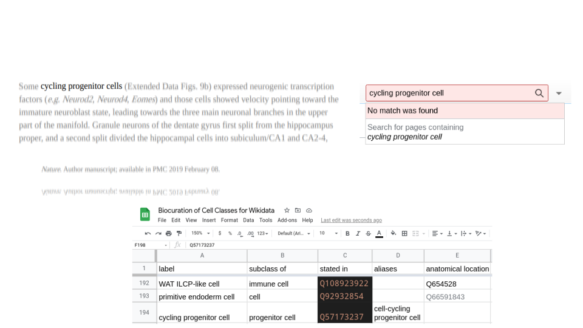

---
title: Building a biological knowledge graph via Wikidata with a focus on the Human Cell Atlas
keywords:
- Wikidata
- Human Cell Atlas
- ontology
- Cell Ontology
lang: en-US
date-meta: '2021-12-03'
author-meta:
- Tiago Lubiana
header-includes: |-
  <!--
  Manubot generated metadata rendered from header-includes-template.html.
  Suggest improvements at https://github.com/manubot/manubot/blob/main/manubot/process/header-includes-template.html
  -->
  <meta name="dc.format" content="text/html" />
  <meta name="dc.title" content="Building a biological knowledge graph via Wikidata with a focus on the Human Cell Atlas" />
  <meta name="citation_title" content="Building a biological knowledge graph via Wikidata with a focus on the Human Cell Atlas" />
  <meta property="og:title" content="Building a biological knowledge graph via Wikidata with a focus on the Human Cell Atlas" />
  <meta property="twitter:title" content="Building a biological knowledge graph via Wikidata with a focus on the Human Cell Atlas" />
  <meta name="dc.date" content="2021-12-03" />
  <meta name="citation_publication_date" content="2021-12-03" />
  <meta name="dc.language" content="en-US" />
  <meta name="citation_language" content="en-US" />
  <meta name="dc.relation.ispartof" content="Manubot" />
  <meta name="dc.publisher" content="Manubot" />
  <meta name="citation_journal_title" content="Manubot" />
  <meta name="citation_technical_report_institution" content="Manubot" />
  <meta name="citation_author" content="Tiago Lubiana" />
  <meta name="citation_author_institution" content="School of Pharmaceutical Sciences, University of São Paulo" />
  <meta name="citation_author_institution" content="Ronin Institute" />
  <meta name="citation_author_orcid" content="0000-0003-2473-2313" />
  <meta name="twitter:creator" content="@lubianat" />
  <link rel="canonical" href="https://lubianat.github.io/quali_phd/" />
  <meta property="og:url" content="https://lubianat.github.io/quali_phd/" />
  <meta property="twitter:url" content="https://lubianat.github.io/quali_phd/" />
  <meta name="citation_fulltext_html_url" content="https://lubianat.github.io/quali_phd/" />
  <meta name="citation_pdf_url" content="https://lubianat.github.io/quali_phd/manuscript.pdf" />
  <link rel="alternate" type="application/pdf" href="https://lubianat.github.io/quali_phd/manuscript.pdf" />
  <link rel="alternate" type="text/html" href="https://lubianat.github.io/quali_phd/v/d4734c3110210b188b6c531653e9e446bd8e91b4/" />
  <meta name="manubot_html_url_versioned" content="https://lubianat.github.io/quali_phd/v/d4734c3110210b188b6c531653e9e446bd8e91b4/" />
  <meta name="manubot_pdf_url_versioned" content="https://lubianat.github.io/quali_phd/v/d4734c3110210b188b6c531653e9e446bd8e91b4/manuscript.pdf" />
  <meta property="og:type" content="article" />
  <meta property="twitter:card" content="summary_large_image" />
  <link rel="icon" type="image/png" sizes="192x192" href="https://manubot.org/favicon-192x192.png" />
  <link rel="mask-icon" href="https://manubot.org/safari-pinned-tab.svg" color="#ad1457" />
  <meta name="theme-color" content="#ad1457" />
  <!-- end Manubot generated metadata -->
bibliography:
- content/manual-references.json
manubot-output-bibliography: output/references.json
manubot-output-citekeys: output/citations.tsv
manubot-requests-cache-path: ci/cache/requests-cache
manubot-clear-requests-cache: false
...


<small><em>
This manuscript
([permalink](https://lubianat.github.io/quali_phd/v/d4734c3110210b188b6c531653e9e446bd8e91b4/))
was automatically generated
from [lubianat/quali_phd@d4734c3](https://github.com/lubianat/quali_phd/tree/d4734c3110210b188b6c531653e9e446bd8e91b4)
on December 3, 2021.
</em></small>

## Authors


+ **Tiago Lubiana**<br>
    {.inline_icon}
    [0000-0003-2473-2313](https://orcid.org/0000-0003-2473-2313)
    · {.inline_icon}
    [lubianat](https://github.com/lubianat)
    · {.inline_icon}
    [lubianat](https://twitter.com/lubianat)<br>
  <small>
     School of Pharmaceutical Sciences, University of São Paulo; Ronin Institute
     · Funded by Grant \#2019/26284-1 from the São Paulo Research Foundation (FAPESP).
  </small>


# Abstract
The Human Cell Atlas (HCA) is an international effort aiming at characterizing every cell type of the human body. 
By the virtue of tecniques such as single-cell RNA sequencing, mass cytometry, and multiplexed in situ hybridization, HCA members are producing cell-level data from virtually all human tissues. 
This wealth of data can have a significant impact on biomedical research, but only if its content is genuinely interoperable.
While ontologies and semantic technologies have emerged as key players in the data interoperability ecosystem, there are still gaps to cover between the technical possibilities and the practical applications in biomedical research.
Wikidata is a knowledge graph database emerging as a FAIR (Findable, Accessible, Interoperable and Reusable) repository for biological knowledge. 
The formatting and deployment of information from the Human Cell Atlas to Wikidata can increase information availability and impact, by inserting the findings in a network containing multiple associations of concepts of all areas of knowledge (within and outside science). 
Conceptually defining cell types in a general and applicable concept, formalized into a database-compatible format, is a massive theoretical challenge. 
This PhD project aims at studying our current understanding of cell types for development a comprehensive ontological model in Wikidata for cell types. 
We will review the single-cell literature, refining and formalizing concepts for cell type delimitation. Furthermore, we will use Natural Language Processing and Machine Learning tools to automate knowledge extraction from scientific articles in the scope of the Human Cell Atlas. 
In an advanced step, we will apply concepts of network theory to develop tools for user-friendly querying of the database, making the knowledge ready for the academic community. 

# Introduction


# Introduction

<!-- 1.4. The challenges of the Human Cell Atlas -->
## The Human Cell Atlas (HCA) Project

<!-- 1.4.1. The Human Cell Atlas project and its scope -->
<!-- 1.4.1.1. Participants -->
The advent of single-cell technologies has ignited the desire of a deep knowledge on cells, the building blocks of life [@wikidata:Q99418649]. 
The Human Cell Atlas (HCA) project, has been a major player in the cell knowledge ecosystem, running since 2017 towards the task to characterize every cell type in the human body [@wikidata:Q46368626]. 
The HCA consortium gathers people from all over the world to tackle different parts of the project, so to have a diverse and equitable account of the cell type diversity. [@wikidata:Q100491106]  

<!-- - 1.4.1.2. Overview of main analytical techniques  -->
Building a full atlas of human cells comes with multiple challenges. The project includes the detection, in single cells, of RNA species (scRNA-Seq), chromatin accessibility (scATAC-Seq), and protein markers (primarily by CYTOF), as well as spatial information on cells with multiplexed _in situ_ hybridization (such as MERFISH) and imaging mass cytometry [@wikidata:Q46368626 ;@wikidata:Q104450645]. Every lab inside the project will contribute with its expertise, providing samples that are representative of human diversity.

HCA is set to revolutionize the biomedical sciences, by creating tools and standards for basic research, as well as allowing better characterization of disease, and thus, ultimately, improving diagnostics and therapy. 
Its products (data, information, knowledge and wisdom) need to be FAIR: findable, accessible, interoperable and reusable.
Data stewardship and data management are growing as core dhttps://www.wikidata.org/wiki/Help:Multilingualemands of the scientific community, ranging from data management plans [@wikidata:Q56524391] to specialized personnel [@wikidata:Q56524391].

<!-- 1.4.3. Data availability -->
<!-- - 1.4.3.1. As coordinated by the Human Cell Atlas -->
The Human Cell Atlas has a dedicated team for organizing data: the Data Coordination Platform (DCP) [@url:https://data.humancellatlas.org/about] [@wikidata:Q104450645].
The DCP is responsible for tracing the plan for computational interoperability, from the data generators to the consumers.[@wikidata:Q104450645].
The Human Cell Atlas  has its portal for data (<https://dahttps://www.wikidata.org/wiki/Help:Multilingualta.humancellatlas.org/>) which composes the data repository landscape with other resources, like the Broad Institute Single Cell Portal (<https://singlecell.broadinstitute.org/single_cell>) and the Chan-Zuckerberg Biohub Tabula Sapiens (<https://tabula-sapiens-portal.ds.czbiohub.org/>). 
In addition to its core team, the HCA is poised to grow by community interaction, and states in its opening paper that "As with the Human Genome Project, a robust plan will best emerge from wide-ranging scientific discussions and careful planning".[@wikidata:Q46368626]  
Thus, this project inserts itself among the wide-ranging scientific discussions to improve data - and knowledge - interoperability. 

The highlight of "knowledge" in the last paragraph is meant to stress that raw data _per se_ is not enough to turn the Atlas objectives into reality. 
There is a long way from raw datasets to commonly agreed scientific knowledge. 
And, ultimately, this long way is what allows humanity to take advantage of scientific endeavors.
Currently, the gap between data and knowledge is mostly targeted via the writing and sharing of scientific manuscripts, the _de facto_ currency of exchange of claims about the natural world. 
The Human Cell Atlas Publication Commitee reviews and selects publications that are directly part of the HCA.
A set of publications is, thus, one of the major outputs of the whole endeavor.

The challenge that arises, thus, is one of managing a wealth of information and cast it into useful science.
Experimental articles that analyze thousands of cells pose an overload of information alone. 
Ideally, we would like to understand, remember and make use of every statement produced by the HCA.
As this goal is humanely impossible, we need to develop tools to make the knowledge interoperable with the aid of computers. 
At that point, the challenges of the HCA enter in resonance with the challenges of text-mining, biocuration and literature based discovery, which will be discussed in the chapter <!-- - 1.1. The quest for interoperable knowledge --> of this introduction. 


# Classification of cells into types

Given that a core goal of the Human Cell Atlas is to advance knowledge about _all_ human cell types, [@wikidata:Q46368626] the definition of what a cell type is becomes important. 
Although a number of views exist [@wikidata:Q87649649; @doi:10.1242/dev.169854; @doi:10.1242/dev.178996; @wikidata:Q47565008; @wikidata:Q99418657; @wikidata:Q98665291; @wikidata:Q93086971; @wikidata:Q26770736; @wikidata:Q35688096; @wikidata:Q98633613; @wikidata:Q99418649; @wikidata:Q40436539; @wikidata:Q108723646], there is no formal, commonly agreed upon defintion of cell type. 
A 2017 article on the Human Cell Atlas mentions[@wikidata:Q47565008]: 

"Descriptors such as ‘cell type’ and ‘cell state’ can be difficult to define at the moment. An integrative, systematic effort by many teams of scientists working together and bringing different expertise to the problem could dramatically sharpen our terminology, and revolutionize the way we see our cells, tissues and organs. We invite you to join the effort." 
The article highlights both the current gap in knowledge and the need of a community effort to work in that direction, in a direction that justifies the existence of the present work. 

One consequence of a lack of a definition is that there is no commonly agreed number of cell types, and not even on an order of magnitude. 
As of November 2021, the leading answers in the Google Search Engine for the question "How many different cell types are found in the human body?" all point to around 200 different types (https://askabiologist.asu.edu/questions/human-cell-types, https://www.researchgate.net/post/How-many-cell-types-in-a-human-body-How-about-the-number-of-cell-cycles-in-each-species, https://www.kenhub.com/en/library/anatomy/types-of-cells-in-the-human-body), an estimate that is agreed upon by Bionumbers, a database of useful biological numbers [@wikidata:Q24643881] (https://bionumbers.hms.harvard.edu/bionumber.aspx?id=103626).
A list of cell types in the adult human body on Wikipedia also amounts to around a couple hundred cell types [@url:https://en.wikipedia.org/w/index.php?title=List_of_distinct_cell_types_in_the_adult_human_body&oldid=1044853788].
However, the Cell Ontology has so far had catalogued 2,311 cell types of interest for the Human Cell Atlas as of June 2021 [@wikidata:Q107373831], increasing the estimate by at least one order of magnitude. 
Additionally, with an estimate of 37 trillion cells on average per human body [@wikidata:Q34037445] and an ever-increasing report of new cell types/clusters in single-cell transcriptomics ([@wikidata:Q103034964]), a precise estimate is not reasonable. 
In fact, the Human Cell Atlas project itself does not commit to any estimates of numbers of cell types, due to the sheer difficulty of estimating a number given current knowledge. (Aviv Regev; reply to question in the HCA conference) 

<!-- Text from https://github.com/lubianat/technotype/blob/9f428cbcf8e8a8d2843faac684275fb0c37914ed/content/02.introduction.md BEGIN-->

Even though there is no agreement, different views on cell types are maturing. 
One core line of thought to define "cell type" is based on the cell type as an evolutionary unit defined by a Core Regulatory Complex (CoRC) of transcription factors. That definition enables the drawing of parallels, from the evolution of other biological entities (such as genes, proteins, and species) to cell types' evolution. Models of how multicellular life works greatly benefit from concepts such as "sister types" (cell types that diverged from a single ancestor), "cell type homology" (cell types in different species that share a common evolutionary origin), and "cell type convergence" (cell types that execute similar functions but which are not directly evolutionarily related) [@pmid:18927580; @doi:10.1038/nrg.2016.127]

Another direction is based on the notion of attractors: regions of dynamical stability in a feature space, which might have different qualities. [@wikidata:Q37475461; @wikidata:Q91908361] In this theory, "basins of attraction" direct cell phenotypes, providing points in, say, a gene expression space towards which different cells "move" their expression programs. This dynamic view see each cell type corresponding to "a self-stabilizing regulatory program, which acts to maintain and restore the cell type-specific program of gene expression." [@wikidata:Q90361677] It alligns itself with dynamic systems theory, and some authors go as far as to say that "Lacking the idea of attractors we have no clear idea of what a cell type is." [@wikidata:Q91316993]

As much as different concepts of species coexist [@doi:10.1080/10635150701701083], our quest to define cell types may take various forms. The challenge of representing cell types in the context of evolution is conceptually different from representing cell types in biomedical experimentation. In that second direction, the groundwork of the Cell Ontology [@wikidata:Q21184168; @doi:10.1186/1471-2105-12-6; @doi:10.1186/s13326-016-0088-7] and CELDA [@wikidata:Q21284308] and the contributions of the International Workshop on Cells in Experimental Life Sciences series [@doi:10.1186/s12859-017-1976-2; @doi:10.1186/s12859-019-2721-9] are notable. 

<!-- Text from https://github.com/lubianat/technotype/blob/9f428cbcf8e8a8d2843faac684275fb0c37914ed/content/02.introduction.md END-->

Even though many sources of knowledge contribute to our knowledge about cell types [@wikidata:Q109717199], arguably single-cell transcriptomics is the workhorse for current efforts of the HUman cell Atlas, with an increasing amount of published studies using the methodology and of cells per study. [@wikidata:Q109717199]
Current scRNA-seq data analyses often rely on unsupervised clustering of cells followed by assignment of cell-type labels to clusters.
For the clustering, bioinformaticians tailor parameter sets to a target resolution, i.e., the level of detail used to detect cell identities. [@wikidata:Q64974172] [@wikidata:Q46368626]
 When the clustering is finished, the groups of cells are annotated with class labels, representing the underlying biology in a language we can understand. [@wikidata:Q107158224]


Instead of assigning expression gates from pre-defined markers, as is the standard for flow-cytometry analysis, single-cell RNA-seq analysis pipelines usually start from _de novo_ clustering of cells followed by cluster annotation. [@wikidata:Q64974172]
While it is clear that clusters and cell types are different concepts [@wikidata:Q64974172], often cluster labels are treated as cell types. 
There are a number of ways to cluster cells to find groups of similarity, but arguably the current default is dirived on the methodology proposed by PhenoGraph. [@wikidata:Q30975629]
The protocol is to calculate the distances between cells in a reduced PCA space (with the number of dimensions chosen by the experimenters), followed by constructing a k-nearest-neighbours network, in which each cell is a node connected by _k_ (another parameter) edges to other cells. 
Once the network is build, network modules (i.e. cell clusters) are commonly found using the Louvain algorithm, published in 2008 by researchers of the Université catholique de Louvain, in Belgium. [@wikidata:Q29305711]
The cell clusters found by the PhenoGraph (or any other) algorithm are then labeled by domain experts, often based on genes differentially expressed on each cluster, so-called "markers". [@wikidata:Q64974172]

While it is possible to manually investigate the identities of which clusters, automatic methods have been developed to aid on the task. [@wikidata:Q107158224]
One approach ("marker-based automatic annotation") bases itself on crossing clusters markers in the analyzed dataset with previous knowledge from databases like PanglaoDB [@wikidata:Q63664483] and CellMarker [@wikidata:Q56984510] [@wikidata:Q107158224].
Another approach (reference-based automatic cell annotation) relies on base, expert-annotated datasets as references from which labels are transferred to the dataset of interest. [@wikidata:Q107158224] 
Other methods bypass the clustering step and focus on labelling the individual cells, which avoids lumping dissimilar cells together, but require a high amount of reads per individual cells for it to be efficient. [@wikidata:Q107158224] 
A recent review and tutorial by Clarke et al [@wikidata:Q107158224] provides an extensive account of current techniques. 

Of note, even though a range of methods is available, the vast majority of techniques and publications do not use standard identifiers for cell types. 
This is in contradiction with the acknowledgement by the community of the advantages of using identifiers the ad using standard identifiers, such as those provided by the Cell Ontology. [@wikidata:Q107158224] [@wikidata:Q33037209] [@wikidata:Q107373831] [@wikidata:Q36067763] [@wikidata:Q52625486]  [@wikidata:Q49192555].
Nevertheless, projects that use Cell Ontology identifiers for single-cell RNA-seq data are appearing [@wikidata:Q109755180], including python and R packages (e.g. Besca [@wikidata:Q104450593], OnClass [@wikidata:Q108929315] and ontoProc[@wikidata:Q101074371]), data management projects and reference datasets, (e.g. Tabula Muris [@url:https://tabula-muris.ds.czbiohub.org/] and Tabula Sapiens [@url:https://tabula-sapiens-portal.ds.czbiohub.org/celltypes] Azimuth map [@url:https://azimuth.hubmapconsortium.org/] and HubMap's ASCT+B Tables [@wikidata:Q109755184]) and annotation platforms (e.g. the Cell Annotation Platform [@url:http://celltype.info] and CellTypist [@wikidata:Q107363182].

As elegantly put by Meehan et al [@wikidata:Q34978215] the Cell Ontology is a "manually constructed computer readable resource that links cell types by different relationships".
it was first described in 2005 by Jonathan Bard, Seung Y Rhee† and Michael Ashburner [@wikidata:Q21184168] and was oriented at creating an "organism-independent classification of cells", following criteria that included function, histology, lineage and ploidy and providing "Cell-type unique identifiers (ID) that can be incorporated into any database holding cell-type-associated knowledge." It also had a didatic goal in itself, as the authors mention [@wikidata:Q21184168]: 
"It is designed to be useful in the sense that a researcher should be able to find, in a rapid and intuitive way, any cell type in any of the major model organisms and, having found it, learn a considerable amount about that cell type and its relationships to other biological objects."
The collaborative project gradually evolved and changed its design and scope to fit new needs. 
By 2011, for example, a need for computable definitions for hematopoietic cell types lead to a sizeable advance in the number and quality of immune cell types represented in CL. [@wikidata:Q33786317] 
It also included the addidion of species-specific cell types to better handle marker-based definitions, which are usually given at the species level. [@wikidata:Q33786317] 
Further developments over the years included both technical improvements as well of the addition of new cell types, and by the time of the last official CL publication, in 2016, it contained approximately 2,200 classes.   [@wikidata:Q36067763]  
The Cell Ontology, currently, is growing as a resource for the Human Cell Atlas and in providing identifiers for cell types [@wikidata:Q109755180].


In conclusion, the advancement of our _formal_ classification of cell types, such as in the Cell Ontology, represents a tangible goal of current cell-oriented large scale projects. 
While purely theoretical developments have their value, refining the cell type theory in the context of knowledge management arguably will have a influence direcly on how the products of the Human Cell Atlas will impact modern science. 
One reason is that formal systems enable automation of knowledge integration, and can feed intelligent systems that aid current research practices. 
In the following chapter, it will be discussed how computer-based knowledge processing can influence life-sciences research, as well as discuss techniques and platforms to advance the frontier. 


## Literature Based Discovery
 <!-- - 1.1. The quest for interoperable knowledge -->
The amount of scholar information vastly outnumbers what single researchers can fathom. 
Nevertheless, the gap between single individuals and the collectively body of knowledge has been widening in 
an accelerated fashion.
The explosion in the number of published articles is leading to a "tsunami of knowlegde",
flooding the scientific literature with rich information. 
That trend became spacially clear during the COVID-19 pandemic, when the huge amount of research published made keeping up with the literature pratically impossible. [@url:https://www.science.org/news/2020/05/scientists-are-drowning-covid-19-papers-can-new-tools-keep-them-afloat @url:https://www.nature.com/articles/d41586-020-03564-y] 
At the same time, articles themselves are becoming denser, as high-throughput (and high-information) technologies
like single-cell RNA-sequencing get cheaper and widely used. 
In practice, thus, too much of the knowledge generated remains unseen by any individual researcher, limiting the reach of science in general.  

 <!-- - 1.1. The quest for interoperable knowledge -->
 <!-- - 1.2.3. Web of Data and Linked Open Data -->
The technological advances, however, are no yet met by equivalent knowledge-handling systems.
Mainstream scientific publication is, nowadays, barely readable by machines.
Articles are written for human consumption, using ambiguous natural language and relying on implicit conventions. 
Tables and data rarely make use of technical standars, such as employing URIs (Uniform Resource Identifiers or encoding information in RDF formats. 
In fact, those standards and their acronyms are foreign for most life scientists (personal observations), despite
being the _de jure_ gold standard for data quality. [@url:https://5stardata.info/en/]
Interconnecting biomedical knowledge is an open challenge of our century, and there is a large way to go
before society can fully benefit from the sum of all knowledge we generate. 

<!--- 1.1.1. Literature Based Discovery, hidden knowledge and text-mining -->
The scientific community has pursue solutions for this tsunami of information from many different angles. 
Narrative reviews, systematic reviews and textbooks compile and synthetize information, providing a layer of processing. 
Biocuration efforts go a step further and transform unstructured information into structured information
in knowledgebases, such as UniProt [@wikidata:Q102383737] and PDB. 
Text-mining apply a range of Natural Language Processing tools to try and extract biological relations,
or provide guidance for biocurators. 
Elaborate knowlegde networks, like the STRING database [@wikidata:Q102383784] and Wikidata[@wikidata:Q87830400], 
combine information from different sources. 

<!-- - 1.1.1.1. Literature Based Discovery (explicitly) --->

The synthesis effort of literature mining is not only an exhibition of the scientific claims in the literature.
Interconnected knowledge provides a way to discover new, implicit knowledge, by applying logical reasoning to a dataset. 
A field denominated Literature Based Discovery [@url:https://en.wikipedia.org/wiki/Literature-based_discovery] dedicates itself to this challenge: make actual discoveries (or at least very strong hypothesis) using as material plainly the existing literature. [@wikidata:Q38371706]
The textbook example of Literature Based Discovery is described by Don Swanson's ABC model: If A is related do B, and B is related to C, then A and C are indirectly related [@wikidata:Q36280460].
In a seminal paper, Swanson showed an hypothesis about using fish oil (A) to treat Raynauld's disease (C), demonstrating that even though the specialized fish-oil (A) literature had shown its association (AB) with a set of blood parameters (B), and the specialized Raynauld's disease literature had show its association (BC) with the same set of parameters (B), the AC link was never made in the literature, despite its seeming obviousness [@wikidata:Q36280460]

<!--- 1.1.1. Literature Based Discovery, hidden knowledge and text-mining -->

Modern advancements of literature-based discovery rely on Natural Language Processing, Machine Learning and Knowledge graphs to make inferences on literature knowledge.
Word embeddings, for example, are leading inference of properties of compounds based on their shared neighbourhood of words (the words before and after their mentiongs) with known compounds, thus making use of latent knowledge in the body of knowledge. [@wikidata:Q91595456]
Other, more explicit approaches, rely on extracted relations embedded in knowledge graphs. As an example, the discovery of new RNA-binding proteins related to Amyotrophic Lateral Sclerosis by analysis of the Watson Drug Discovery gene-disease network. [@wikidata:Q47406275]

Knowledge graphs have a set of characteristics that make then useful for Literature Based Discovery: they represent multiple relations, allow inferences on top of those relations, and provide human understandability at every step, allowing for a dialog between expert humans and computing systems.
The field of biomedical ontologies explores that direction in depth, and the community is building many solutions, widely applicable for the biomedical sciences.

For the Human Cell Atlas Project (as presented in the chapter <!-- 1.4. The challenges of the Human Cell Atlas -->) to maximize its benefit for society, it is arguably important that its knowledge products are inserted into the main route of automated knowledge discovery . 
That implies a task of building knowledge graphs able to deal with it at all layers, including the generated data and metadata, its range of different protocols, and the purified knowledge projects that are enshrined in publications.
Thus, the chapter <!-- - 1.2. Formal representation of knowledge and - 1.3. Knowledge Representation in biology -->  will present challenges and paths for applying literature based discovery on a large scale and with sufficient flexibility to deal with the Human Cell Atlas. 


## Ontologies
<!-- - 1.2. Formal representation of knowledge and - 1.3. Knowledge Representation in biology --> 

The classification of biological concepts is at the core of biology. At least since the Aristotelian endeavours to group classes of animals, a good part of the scientific work is to capture concepts into knowledge systems   [@wikidata:Q105870680]. 
Linnaeus' binomial system for naming species and Mendeleiev's periodic table are likely the two most famous classification systems, but are part of a much larger ecosystem of structuring scientific knowledge. 

<!-- - 1.2.1. Descriptional logic and its historical context -->

On the 20th century, the development of the analytical philosophy of Russel and Wittgenstein and their search for formalizations  [@wikidata:Q105105637] gradually layed the foundations for the the logic of scientific descriptions. Karl Popper and his "The Logic of Scientific Discovery"[@wikidata:Q1868040] was heavily influenced by analytical philosophy, and the field is at the foundation of the "falseability" system of Popper. Less known among life scientists, Tarski's inquiries on what can be considered to be "true" [@wikidata:Q106090790] were also 

The whole movement for formalization of knowledge progressed on the computational end, and at the late 20th century were at the root of the functioning of the World Wide Web, the advent of computational ontologies and large scale knowledge graphs.
In this chapter, I will provide an overview of ontologies and knowledge graphs and their use in today's biomedical sciences, alongside its future prospects. 

### The OBO Foundry and biomedical ontologies

An ontology, as used here, is a formal computational representation of reality, which tries to represent each concept (and their relations) as precisely as possible.  [@wikidata:Q105870680]  
Constructing an ontology is a process of selecting and defining terms of interest, selecting and defining relationships of interest and making statements about reality using terms and relationships. 
The Gene Ontology is probably the most well known biomedical ontology; it describes (among other things) different classes of biological process, related to each_other by "is_a" and "part_of relations. [@wikidata:Q104130127] [@wikidata:Q23781406].


The Gene Ontology is part of a much larger effort to formalize concepts across biology: the Open Biomedical and Biological Ontologies (OBO) Foundry. [@wikidata:Q19671692]
Created in 2007, the OBO Foundry is a hub of biomedical ontologies that sets guidelines for the design and construction of high-quality ontologies. 
The initial OBO Foundry united several independent ontologies, like the Cell Ontology (CL), the Disease Ontology (DO) and the Protein Ontology (PRO) under a common framework towards interoperability. 
At the same time, the creation of the Relation Ontology (RO) provided a go-to point for relations in biology that could them be reused by different ontologies.

### OWL and ontology languages 
One of the OBO Principles for its ontologies is that they should be resolvable as a "syntactically valid OWL file using the RDF-XML syntax." (http://www.obofoundry.org/principles/fp-002-format.html). 
The OWL Web Ontology Language was introduced as a standard by the W3C consortium in 2004. 
OWL is not a programming language, as it does not instruct computers to perform actions, but an ontology language, which allows computerizable descriptions of the world. 
Furthermore, it is an umbrella ontology language that includes several languages with varying levels of expressivity. 
Generally, more expressive languages can represent more complex ideas, but make computations harder.

Regardless of the sublanguage used by ontology it must be resolvable to an RDF-XML file. RDF stands for Resource Description Framework, another W3C standard built around a graph-based data model (https://www.w3.org/TR/rdf11-concepts/). 
Statements in RDF are triples consisting of 2 nodes (a subject and an object) and an edge (a predicate) connecting the nodes. 
All nodes and edges are represented in RDFs by International Resource Identifiers (IRIs), and there are many ways to lay out those IRIs on a text file to represent triples. 
One of those layouts is the RDF-XML syntax, inspired by the XML markup language. 
Arguably, other syntaxes (interchangeable with RDF-XML) are easier to read for human. 
As an example of an RDF triple, here is how one would represent in the Turtle RDF Syntax, the notion that plasmacytoid dendritic cells are a type of dendritic cells:

```
http://purl.obolibrary.org/obo/CL_0000784  http://www.w3.org/2000/01/rdf-schema#subClassOf  http://purl.obolibrary.org/obo/CL_0000451 .
```
Where http://purl.obolibrary.org/obo/CL_0000784 and  http://purl.obolibrary.org/obo/CL_0000451  are the unique IDs in the Cell Ontology for "plasmocytoid dendritic cells" and dentritic cells, respectively, and http://www.w3.org/2000/01/rdf-schema#subClassOf is the identifier for the "subclass of" relation as defined by the RDF schema. 

A longer explanation of the details of OWL and RDF is outside the scope of this work. 
This brief introduction has a dual goal of introducing the architecture of formal representations and of demonstrating the complexity of the system.
There is a high energy barrier to acquire the knowledge and the technical skills to  engage in ontology building. 
That complexity might be one of the reasons why a very small fraction of the biomedical communities represents data with ontologies and an even smaller fraction engages with ontology building. 


## Wikidata

<!-- - 1.2.3. Web of Data and Linked Open Data -->
Even though the Semantic Web  (which ontologies are a part of) spawned with promises of a revolution in the way knowledge is shared, it is still to be widely known outside the semantic engineering. Two recent projects are playing a particularly important role in bringing the Semantic Web to a wider audience has been receiving a boost of attention recently powered by two large projects: the Google Knowledge Graph and Wikidata. 


The Google Knowledge Graph introduced the Semantic Web _de facto_ in the daily life of users of Google. [@url:https://blog.google/products/search/introducing-knowledge-graph-things-not/ ]. Its underlying structure is similar to the triples in an ontology, but it is less concerned with being logically coherent, and does have strict semantics of a representation. 
In that way, Google Knowledge Graphs can feed on a variety of sources and not crash if there is some data modelling that, rigorously, could be inconsistent.
Even though there is not a rigorous boundary between ontologies and knowledge graphs, one reasonable interpretation is that a knowledge graph may not be perfectly coherent, as long as it still can provide enough knowledge and reasoning for the approach of interest. 
While the lack of formal semantics limits reasoning and inference, the knowledge graphs are arguably easier to use, edit and and understand, and so provide an user friendly alternative for computable information with a lower entry barrier. 


While the Google Knowledge Graph is widely used as a source of knowledge, it does not allow independent users to contribute with information. 
On the other hand, Wikidata, the collaborative knowledge graph of the Wikimedia foundation, allows users to contribute with classes and statements, in the same spirit of Wikipedia and share its "epistemic virtues, like power, speed and availability. [@wikidata:Q101955295]
Its power is derived of its large community of contributors, closedly linked to the hugely successful Wikipedia.
With a community of more than 20,000 active editors (https://www.wikidata.org/wiki/Wikidata:Statistics) and growing, it is able to cover a much wider number of concepts than any user individually. 
It is fast, because one does not need to install any software or ask for permissions to update it: any user can simply do it via a web interface. 
That speed makes it easier for newcomers to join and contribute, in contrast to OBO Foundry ontologies, which require extensive training on semantics and knowledge of Git/GitHub for contributions. 
Finally, the information on Wikidata is available via an user interface, via a SPARQL query service and as large, full-size database dumps, providing full extent reusability. 
The Wikidata model has been so sucessfull that Google decided to migrate its own knowledge base, Freebase, fully into Wikidata.[@wikidata:Q24074986]


### The inner workings of Wikidata
<!-- Wikidata's technical infrastructure -->

Wikidata uses the same framework (RDF) that powers ontologies, and its model represents statements about the world in triples containing a subjects, a property and an object. [@url:https://www.mediawiki.org/wiki/Wikibase/DataModel] 
Its data model is serialized both in JSON and RDF.
The data model contains 17 different datatypes, including, for example "Item", any entry on Wikidata that refers to "o a real-world object, concept, or event that is given an identifier in Wikidata" and "String", a "sequence of freely chosen characters interpreted as text". [@url:https://www.wikidata.org/wiki/Help:Data_type].
Knowledge is stored on Wikidata upon basic triples containing a subject (of type "Item"), a property and a value (which can be of any of the 17 types). 
As of November 2021, Wikidata contains more than 90 million data items [@url:https://www.wikidata.org/wiki/Wikidata:Statistics] and more than 9000 properties that link them to values. 
As values often are other items, the database aquires a network format with labeled edges.


As can be seen in the example in @fig:douglas_adams, each the items in the database contain an item identifiers (Q followed by numbers). 
They also contain a label, a description and a list of aliases, which can be recorded in any of the more than 200 hundred languages, thereby making it a multilingual project. [@url:https://www.wikidata.org/wiki/Help:Multilingual]
Each item is decorated with statements, comprising of property-value pairs. 
These pairs can be further specified via qualifiers and references, which treats the full triple as the subject, adding metadata to it (a process called reification [@url:https://www.w3.org/TR/rdf11-mt/#reification]).
Qualifiers provide ways to extend the information on the triple, while references provide provenance, enabling users to judge the validity of the claims in the database. 

{#fig:douglas_adams}


All the information is available on a user interface, but its data is also available programatically in diverse formats, including as full JSON and RDF dumps, the MediaWiki API and a SPARQL endpoint. [@url:https://www.wikidata.org/wiki/Wikidata:Data_access]
A number of wrappers of such services are available in languages such as R [@url:https://www.rdocumentation.org/packages/WikidataR/versions/2.2.0] and python [@url:https://pypi.org/project/wikidata2df/]. 
A scheme of the data can be seen in @fig:datamodel, where each item is connected to a statement node via a property in the "p:" namespace, from which references and qualifiers are acessible. 
To facilitate basic usage, the namespace "wdt:" connects items to values directly, simplifying, for example, the writing of SPARQL queries. 


{#fig:datamodel}

Information on Wikidata is released under a CC0 license, which enables full reuse of the data. [@url:https://www.wikidata.org/wiki/Wikidata:Licensing]
One of the major points of access and reuse of the information is the Wikidata Query Service [@url:https://query.wikidata.org/], a core resource of the community which enables live querying in the SPARQL language. [@url:Q56010228] 
A number of services make use of embedded queries from the Wikidata Query Service [@url:https://query.wikidata.org/] to create interactive, live dashboards, for example Scholia [@url:https://scholia.toolforge.org/] aht the SARS-CoV-2 Query Book [@url:https://egonw.github.io/SARS-CoV-2-Queries/] 


Wikidata is not only acessible in different ways, but also writable in many ways. 
It provides a user-friendly, point-and-click interface for modifying the database, providing a low entry barriers for newcomers.
It is also possible to semi-automatically reconcile spreadsheets to Wikidata items and use batch tools such as Open Refine [@url:https://www.wikidata.org/wiki/Wikidata:Tools/OpenRefine] and Quickstatements [@url:https://www.wikidata.org/wiki/Help:QuickStatements], which enable batches on the magnitude of  thousands of edits. 
For larger amounts of edits, it is possible to ask for bot permissions [@url:https://www.wikidata.org/wiki/Wikidata:Bots] and deploy systems that integrate big data sources.
Bot edits are made via the WikiMedia API and are predominantly written via Python wrappers, such as Pywikibot [@url:https://www.wikidata.org/wiki/Wikidata:Pywikibot_-_Python_3_Tutorial] and the Wikidata Integrator. [@url:https://github.com/SuLab/WikidataIntegrator]


###  Wikidata as a knowledge graph for the life sciences 


Due to its privileged position inside the linked data ecosystem and its ease of write and query, Wikidata has been growing as a hub for interoperable data for the life sciences community. [@wikidata:Q87830400] [@wikidata:Q68471881] 
Even though Wikidata was created in 2013, the demand for a community-cured life sciences knowledge graph is clear at least since 2008 [@wikidata:Q28292893] [@wikidata:Q21183907] 
The Wikidata-like project proposed at the time was eventually discontinued, an example of the challenge of maintaining independent biomedical databases. [@wikidata:Q28595967]
As Wikidata has a very large community, has stable funding and is at the core of modern technologies, like the Google Knowledge Graph [@wikidata:Q24074986] and Amazon's Alexa, [@url:https://www.wired.com/story/inside-the-alexa-friendly-world-of-wikidata/] it is virtually guaranteed that data in Wikidata will remain acessible for a long time, regardless of local funding schemes. 

The Gene Wiki project [@wikidata:Q21092744] was likely the first large scale biomedical project to rely directly on the Wikipedia infrastructure for community curation. 
It provided a direction connection between the generalist community of Wikipedia and domain experts. 
The interplay of both communities is a topic of discussion and the opportunities and challenges were already discussed in NAR in 2012. [@wikidata:Q28254676]  
Notably, Wikidata appeared chronologically after those efforts.  
Notwithstandingly, the Gene Wiki research group has embraced the Wikidata environment for community biocuration and data interoperability [@wikidata:Q23712646][@wikidata:Q28529449] [@wikidata:Q87830400] [@wikidata:Q63286185]. 
The information on Wikidata is still integrated to Wikipedias across multiple languages, often as source of information in Wikipedia's infoboxes.  

Other projects outside the Gene Wiki innitiative also started using Wikidata as a platform for knowledge integration. 
A list of several projects that use Wikidata as part of their service to their community is given on table 1. 
There is movement exploring how Wikidata can be employed to the advance of Computational Biology, and how it can be integrated to current publication status quo. [@wikidata:Q54655231]
In that direction, Wikidata is being developed as a platform for scholarly linked open data, particularly via the Scholia platform [@wikidata:Q41799194] [@wikidata:Q63433973],(<https://scholia.toolforge.org/>) which provides profiles of pre-templated SPARQL queries for entities like particular authors and articles (e.g. Scholia profile on Prof. Helder Nakaya: https://scholia.toolforge.org/author/Q42614737).  

# [Table 1](https://docs.google.com/spreadsheets/d/1loPE0bfJsih4eLrwNGvQf2c-9_I8z-GEvV21496o8h8/edit#gid=0)

During the COVID-19 pandemic, Wikidata has spawned as a hotspot for modelling information about the virus and the pandemic in real time.  [@wikidata:Q108766311] [@wikidata:99196713]
The general scope of the databasae allowed representation in a shared system of molecular, epidemiologic and socio-economic aspects of the pandemic. [@wikidata:Q108766311][@wikidata:Q105037759]
Information curated in Wikidata was immediately available, feeding live dashboards and other applications based on SPARQL queries .[@wikidata:Q88647643]  [@wikidata:Q105833381] [@wikidata:Q106249454] 
Additionally, as the information presented on Wikidata is multilingual and collaboratively edited, it presented itself as a resource for constructing structured vocabularies in non-english languages. [@wikidata:Q107377131]  

In addition to its value as a structured database, Wikidata is tightly connected to Wikipedia.
The gene identifiers in the context of Gene Wiki [@wikidata:Q23712646] are now fed to Wikipedias across languages, benefitting users directly.
Additionally, gene expression information from the Bgee database [@wikidata:Q100513179] was added to Wikidata and connected to Wikipedia, which lead to a sizeable increase of the Bgee database. Currently, Wikipedia is one of the top 3 sources from which people access Bgee (personal communication with Tarcisio Farias, https://scholar.google.fr/citations?hl=fr&user=sB87J-cAAAAJ), thus leading to direct recognition for integrated bases.
More generally, the connections of Wikidata and Wikipedia make it unique in the power of flowing knowledge back to human-acessed interfaces. 
In the words of Matthias Samwald [@wikidata:Q21503276] and colleagues "Wikidata could emerge as a community-backed and highly visible structured knowledge base of medical and biological information, bringing concepts and methodologies such as controlled taxonomies, Semantic Web / semantic technologies and ontologies into mainstream use."


In conclusion, Wikidata's unique position, robustness and guarantee of long term stability, prompts the need of works exploring new ways of integrating it to current knowledge management. 
Given the speed and breadth of the Human Cell Atlas, and the challenges of knowledge representation on cell types, this PhD work plans on discovering and adressing knowledge gaps on how Wikidata can play a role in organizing and disseminating the discoveries about all human cell types. 


# Objectives 

* Study and refine theories of classes of cells within the constraints of ontologies and knowledge bases

* Provide a comprehensive list of currently described cell types on Wikidata
    * Develop a biocuration framework for the task of sharing information on Wikidata 
    * Catalog as many cell types as possible, as a groundwork for future applications 

* Devise ways to connect the Human Cell Atlas and other life-sciences products to Wikidata: 
  * Craft wikidata relations ("properties") for making cell-type-related assertions
  * Write bots and scripts to reconcile data sources to Wikidata

* Provide proofs-of-concepts of how Wikidata integration can benefit the advancement of HCA


# Methodology

This project's methodology resembles practical research-action practices [@wikidata:Q108479295]. Its goals of improving inteoperability of cell-type data implies a combination of action and research. Action in the form of active contributions to ontologies and knowledge-graphs, by getting involved and contributing to ongoing projects in the context of the Human Cell Atlas and knowledge management. Research in the 3 forms:
    - Philosophical investigation on the nature of knowledge representations of cell types, both in formal logic settings and in current academic practice
    - Applied investigations of database integration and data quality in the context of Wikidata and biomedical ontologies
    - Data-driven biomedical research targeted at hypothesis generation and literature-based discovery using knowledge at the level of cell-type

All the research forms are intertwined with the improvement of knowledge management in biomedical sciences, with a focus on the Human Cell Atlas. The methods included the development and application of a framework for organized reading of the scientific literature, aimed at providing contact with the different facets of biocuration and Human Cell Atlas-related research. 

## Organized reading

To handle the literature reading necessary for this project, a framework was developed for reading and is described in details in the results section. 
The framework is based on GitHub and includes Python scripts, a file organizing the reading list, and another documenting the reading history in RDF. Notes and additional information are saved in a GitHub repository, and the structured information powers a live website with analytics on the users recent readings. The source code for Wikidata Bib is available at <https://github.com/lubianat/wikidata_bib/tree/template> and notes on my readings can currently be accessed at <https://lubianat.github.io/wikidata_bib/>.

Additionaly, the methodology included a discipline of reading that entails the daily reading of 2 articles, one about "cell types" and another about "biocuration". 
The articles are obtained by a mixed manual and automatic approach, including a la carte selection of articles to read alongside Wikidata queries for Cell, Nature, Science and eLife papers about single cell transcriptomics (query: <https://w.wiki/4LHr>) and for papers on biocuration (query: <https://w.wiki/4LHi>). 
)

### Biocuration of cell classes for Wikidata

For each article about cell types read, cell types previously absent on Wikidata are added via a combination of curation in a Google Spreadsheet and a custom Python script (https://github.com/lubianat/wikidata_markers/tree/master/curation_of_classes).  

### Annotation of Human Cell Atlas articles

Human Cell Atlas publications (https://www.humancellatlas.org/publications) were selected and abstracts were annotated as richfully as possible with Wikidata IDs using the hypothes.is annotation system (https://web.hypothes.is/). One article [@wikidata:Q46368626], describing the complete Human Cell Atlas project, was annotated in full. Annotations were retrieved via the hypothes.is API and processed with custom Python and R scripts (https://github.com/lubianat/ann/tree/main/hypothesis_parsing).

## Wikidata updates

Wikidata is similar to a graph database, and is flexible enough to add new relations without need to change the underlying infrastructure. 

Creation of new entities was done either manually in the Graphical User Interface (<https://www.wikidata.org/wiki/Special:NewItem>) or via custom python scripts combined with the Quickstatements tool (<https://quickstatements.toolforge.org/#/>) or the Wikidata Integrator python library (<https://github.com/SuLab/WikidataIntegrator>). 

Properties, which link items to values, cannot be created at will and need to undergo community approval. Under the scope of this PhD project, we have gotten the community approval for a number of properties: 

- entry receptor (<https://www.wikidata.org/wiki/Property:P8339>) used to link pathogens to their cellular entry receptors. 
- Cell Ontology ID (<https://www.wikidata.org/wiki/Property:P7963>) used to link cell types to their IDs in the Cell Ontology
- has marker (<https://www.wikidata.org/wiki/Property:P8872>) used to link cell types to genes and proteins considered their markers
- derived from organism type (<https://www.wikidata.org/wiki/Property:P9072>) used to link cell lines to the taxon of the organism from which it was derived. 

The property acceptance cycle takes at least one week and is completely open for opinions by any Wikidata user. All the information regarding the property proposal is available at <https://www.wikidata.org/wiki/Wikidata:Property_proposal>.


## Cell Ontology participation

As part of the research-action process, I have joined the Cell Ontology working group. 
I participate in the monthly meetings and sporadic workshops, learning and contributing to the discussions. 
Additionaly, I contribute to the ontology development, actively engaging in the Cell Ontology GitHub repository (<https://github.com/obophenotype/cell-ontology>) and contributing with new terms and assertions. 
I edit the ontology with the software for ontology editing Protégé v. 5.5.0 (<https://protege.stanford.edu/>).

### Status of cell type info on Wikidata

Status of cell type information on Wikidat was acessed via SPARQL queries combined with processing in python and is available at <https://colab.research.google.com/drive/1GvQXOs51_U8icdGMtKXMeLOXKM8pXWet#scrollTo=szvBWI9zr_AA>


# Preliminary Results

<!-- Maybe include annotation of HCA articles ? -->
<!-- Maybe include Scholia and Bioinformatics ? -->


## Concept of cell types  {.page_break_before}


### General work on the concept of cell type
As an initial step of this PhD project, we decided to investigate the definition of "cell type" and how to shape a definition for knowledge management on Wikidata. 
The definition of the concept of "cell type" is currently a topic of debate by the biomedical community.[@wikidata:Q87649649; @doi:10.1242/dev.169854; @doi:10.1242/dev.178996; @wikidata:Q47565008; @wikidata:Q99418657; @wikidata:Q98665291; @wikidata:Q93086971; @wikidata:Q26770736; @wikidata:Q35688096; @wikidata:Q98633613; @wikidata:Q99418649; @wikidata:Q40436539].
Before we proceeded with the knowledge-graph formalizations via Wikidata, we dedicated time for a theoretical research on the concept of "cell type" in the context of knowledge representation. 
This line of research aligns itself with the groundwork of the Cell Ontology [@wikidata:Q21184168; @doi:10.1186/1471-2105-12-6; @doi:10.1186/s13326-016-0088-7] and CELDA [@wikidata:Q21284308]  and the contributions of the International Workshop on Cells in Experimental Life Sciences series [@doi:10.1186/s12859-017-1976-2; @doi:10.1186/s12859-019-2721-9].

In this period, we targeted the question: which cell type definition allows crafting coherent biological statements? 
The goal was to not say what cell types _are_, but what they can be for a consistent representation on an ontology or a knowledge graph, like Wikidata.
We avoided the dissection of the differences between persistent classes of cells (often called "cell types") or the transient, fugacious classes of cells (often called "cell states") (see "Definition of cell identity" section in [@wikidata:Q48563763] for an example).
Even though such a distinction is an essential topic for theoretical research, it is not required to represent formally biomedical experiments.

To facilitate communication among life scientists, in a preprint derived from this PHD project[@doi:10.22541/au.160979530.02627436/v1], we proposed, among other theoretical novelties, naming conventions for different cell types classes. 
Much of the literature mixes cell types in one species (e.g., when dealing with a cell type as an evolutionary unit) or multiple species (e.g., in the Cell Ontology). 
It is useful to distill these different concepts into names. Given the importance of the species' concept in biological classification [@wikidata:Q1189395], we derive a species-centric view on the naming of classes of cell types. 
The four classes (Figure @fig:classes) we propose are as follows:

- archetypes, for when the taxonomic scope of the type is beyond the level of species; for example, "mammal neutrophils."
- _sensu stricto_ cell types, for when the taxonomic scope of the type corresponds to a single species; for example, _Mus musculus_ neutrophils."
- infratypes, for when the taxonomic scope is below the level of species; for example, considering the mouse strain "C57BL/6J", "neutrophils from C57BL/6J mice". 
- technotypes, for specific, experimentally defined cell types that harbor in their definition the precise conditions of the cells sampled; “2-month-old male C57BL/6J, Ly-6G<sup>+</sup> CD11b<sup>+</sup>  M-CSF R<sup>-</sup>  CD244<sup>-</sup> neutrophils”.

{#fig:classes}

The 4 different categories of cell types help us to better organize the knowledge about cell types. 
Even though individual articles and databases often have species-neutral names, the information often comes from experiments with a single strain of a single species.
Two articles might call by the same name cells that come from different animals, or were selected by different protocols. 
Large scale knowledge management requires an organized way of representing those details.

The division between archetypes and _sensu stricto_ cell types is of special importance in the context of biocuration and annotation of data. 
Associations like the  HUGO Gene Nomenclature Committee and UniProt organize names and identifiers for genes and proteins in single species. 
Thus, if we want to annotate marker genes, for example, we need to associate them to a species-specific cell type (a _sensu stricto_ cell type) instead of the more vague association to a species-neutral type. 
That might seem obvious, but current standards still use identifiers that are species-neutral (e.g. in the reference HuBMAP app; <https://azimuth.hubmapconsortium.org/references/>)

The ontological discussion on the classes of cell types, thus, extends the current state-of-the-art and introduce new ways to organize our knowledge about cells. 
Notably, the technotype and the infratype are, currently, mostly theoretical constructs and almost no resources deal with cell types at the level of strains or below. 
The division of archetypes and _sensu stricto_ cell types, on the other hand, was already instrumental for the integration of the Panglao database of cell markers to Wikidata, described in a future session.

### A simplified definition

 Refining the different concepts around the notion of "cell type" is important, but will require decades before a reasonable consensus. 
Here we adopt a liberal view of cell type, defining, for our purposes, a cell type as "any class of cells described by a domain expert".
By "class" we mean an abstract entity in the sense intended by the multilevel theory of conceptual modelling (referred as "_types_" by Carvalho et al. ) [@wikidata:Q108926456]

Figure @fig:multilevel represents the adaptation of Multi Level Theory that is assumed for the modelling done throughout this work. 
The notion is time-agnostic (i.e. it is not concerned if their objects _exist now_ or just _existed in the past_) and organizes the theoretical world into 3 kingdoms: _individuals_, _classes_ and _metaclasses_. 

{#fig:multilevel width="85%"}

Figure @fig:multilevel A multilevel theory (MLT) can divide the theoretical realm into different kingdoms. A) A representation of people in the MLT framework adopted in this work. The theoretical-realm entity "Mahatma Gandhi" is materialized by the material-realm Mahatma Gandhi. The theoretical _individual_ is considered an instance of  multiple _classes_ such as "Indian lawyer" and "_Homo sapiens_", which are related to each other via subclass relations. The classes themselves are instances of _metaclasses_, like "taxon", a first order metaclass. B) An analogous representation of the MLT framework, but applied to cells and cell types. 

* Justifying the selection: MLT and basic formal ontology 

* Justifying the selection: MLT and wikidata


## PanglaoDB integration to Wikidata  {.page_break_before}

### Introduction

The process of making the Human Cell Atlas more useful via Wikidata also includes the connection of related databases. 

PanglaoDB [@https://panglaodb.se/index.html] [@doi:10.1093/database/baz046] is a publically-available database that contains data and metadata on hundreds of single-cell RNA sequencing experiments. 
It provides extensive information on cell types, genes, and tissues and cell type markers, obtained both via automatic and manual methods.
It also displays a rich web user interface for easy data acquisition, including database dumps for bulk downloads.


As of 17 June 2021, the article describing PanglaoDB had been cited 147 times. 
Despite its use by the community, the database is on a 3-star category for Linked Open Data [@url:https://www.w3.org/DesignIssues/LinkedData.html] as it does not use the open semantic standards from W3C (RDF and SPARQL) needed for a 4-star rank, neither the links to external data via standard identifiers that make datasets 5-star. 
Improving the data format toward W3C's gold standards is a valuable step in making biological knowledge FAIR (Findable, Accessible, Interoperable, and Reusable). 
Thus, we aimed to provide a case study of making the core information of PandlaoDB available in a 5-star Linked Open Data Format while improving the modeling of the necessary concepts on Wikidata.

As of August 2020, Wikidata had 264 items being categorized as a "cell type", considerably less than in specialized cell catalogs, which count over two thousand cell types [@wikidata:Q28660708; @wikidata:Q36067763].
Strikingly, there were also 23 items categorized as "instances of cell (Q7868)" . This classification is imprecise, as an instance of cell would be an individual named cell from a single named individual.

Wikidata editors often mix first-order classes such as "cells" and "organs" with second-order classes like "cell types" and "organ types" (Supplementary Information). First-order classes point to real-world individuals, like the "Dolly sheep zygote" (a real-world "cell") and the "brain of Albert Einstein" (a real-world "organ"). Second-order classes point to classes, like "zygote" (a conceptual "cell type") and "brain" (a conceptual "organ type").

We diligently fixed and improved information on cell types on Wikidata. 
As of 17 June 2021, the Wikidata database contains 2102 instances of "cell type" (see current status at <https://w.wiki/b2t>) and 0 instances of "cell" (<https://w.wiki/b2q>) highlighting the improvements in both quantity and quality. 


### Methodology 

After obtaining approval from the owners of the database, we matched genes and cell types to Wikidata, and performed Wikidata queries to demonstrate the value of the approach. An overview of the process is shown in @fig:iscb_intro.
{#fig:iscb_intro width="85%"}

### Class creation on Wikidata

Classes corresponding to species-neutral classes were retrieved from Wikidata manually using Wikidata's Graphic User Interface. 
A manually-curated dictionary matching terms in PanglaoDB to Wikidata identifiers was assembled and used for integration. 
Cell types that were not represented on Wikidata were added to the database via the graphical user interface (<https://www.wikidata.org/wiki/Special:NewItem>) and logged in the reference table.

Species-specific cell types for human and mouse cell types were created for every entry in the reference table and connected to the species-neutral concept via a "[subclass of](http://www.wikidata.org/entity/P279)" property (e.g. every single "[human neutrophil](http://www.wikidata.org/entity/Q101405102)" is a also "[neutrophil](http://www.wikidata.org/entity/Q188417)"). 
Our approach was analogous to the one taken by the CELDA ontology to create species-specific cell-types [@wikidata:Q21284308].

#### Integration of PanglaoDB to Wikidata 

After receiving authorization by e-mail from the PanglaoDB developer, Oscar Franzen, the PanglaoDB markers dataset was downloaded manually from PanglaoDB's website (<https://panglaodb.se/markers/PanglaoDB_markers_27_Mar_2020.tsv.gz>) for integration. It contains 15 columns and 8256 rows. Only the columns `species`, `official gene symbol`, and  `cell type` were used for the reconciliation. 
The reconciled dataset was uploaded to Wikidata via the WikidataIntegrator Python package [@https://github.com/SuLab/WikidataIntegrator], a wrapper for the Wikidata Application Programming Interface. 

#### SPARQL queries

Besides the Wikidata Dumps, Wikidata provides an SPARQL endpoint with a Graphical User Interface (<https://query.wikidata.org/>). 
Updated data was immediately accessible via this endpoint, enabling integrative queries integrated with other database statements.
### Results

#### Cell Marker information on Wikidata

Adding marker information on Wikidata was not possible before this study and became possible after we proposed and got community approval of the property "has marker" (P8872).
Figure @fig:chat_marker shows 2 of the current markers of "human colinergic neuron"([Q101405051](http://www.wikidata.org/entity/Q101405051)), [CHAT](http://www.wikidata.org/entity/Q14863671) and [ACHE](http://www.wikidata.org/entity/Q407983), as they are seen on Wikidata.
The PanglaoDB is referenced both via URL to the website (<https://panglaodb.se/markers.html>) and a pointer to the PanglaoDB item on Wikidata, [Q99936939](http://www.wikidata.org/entity/Q99936939).


{#fig:chat_marker width="85%"}


Now that we re-formatted the markers on PanglaoDB as Linked Open Data, we can make queries that were not possible before, including
federated queries with other biological databases, such as Uniprot [@https://sparql.uniprot.org/sparql]
and Wikipathways [@https://www.wikipathways.org/index.php/Portal:Semantic_Web].
Due to previous similar reconciliation projects, Wikidata already contains information about genes, including their relations to Gene Ontology (GO) terms.

PanglaoDB's integration to the Wikidata ecosystem allows us to ask a variety of questions (figure @fig:iscb_results).

{#fig:iscb_results width="85%"}

### "Which human cell types are related to neurogenesis via their markers?"

As expected, the query below retrieved a series of neuron types, such as "[human purkinje neuron](https://www.wikidata.org/wiki/Q101404913)" and "[human cajal-retzius cell](https://www.wikidata.org/wiki/Q101405091)." It also retrieved non-neural cell types such as the "[human loop of henle cell](https://www.wikidata.org/wiki/Q101405109), a kidney cell type, and "[human osteoclast](https://www.wikidata.org/wiki/Q101404928). These seemingly unrelated cell types markedly express genes involved in neurogenesis, but that does not mean that they are involved with this process. The seemingly confusing results reinforce the idea that one needs to be careful when using curated pathways to enrich one's analysis, as false positives abound.

The molecular process that gene products take part depends on the cell type. SPARQL allows us to seamlessly compare Gene Ontology processes with cell marker data, providing a sandbox to generate hypotheses and explore the biomedical knowledge landscape.

| geneLabel | cellTypeLabel                   |
| :-------- | :------------------------------ |
| OMP       | human purkinje neuron           |
| OMP       | human olfactory epithelial cell |
| OMP       | human neuron                    |
| EPHB1     | human oligodendrocyte           |
| EPHB1     | human osteoclast                |
| PCSK9     | human delta cell                |
| PCSK9     | human loop of Henle cell        |
| CXCR4     | human b cell                    |
| CXCR4     | human T cell                    |
| CXCR4     | human nk cell                   |

Table: Sample of 10 cell types related to neurogenesis via markers (07/02/2020, full query on <https://w.wiki/yQ6>).
{#tbl:neuro}


### "Which cell types express markers associated with Parkinson's disease?"

Besides integration with Gene Ontology, Wikidata reconciliation makes it possible to complement the marker gene info on PanglaoDB with information about diseases. This integration is of biomedical interest, as there is a quest to detail mechanisms that link genetic associations and the diseases themselves.

"Disease genes" are often compiled from Genomic Wide Association Studies, which look for sequence variation in the DNA. These studies are commonly blind to the cell types related to the pathophysiology of the disease. In the query below, we can see cell types marked by genes genetically associated with Parkinson's disease. Even considering the false positives, the overview can aid domain experts in coming up with novel hypotheses.

| geneLabel | diseaseLabel        | cellTypeLabel    |
| :-------- | :------------------ | :--------------- |
| BST1      | Parkinson's disease | human b cell     |
| BST1      | Parkinson's disease | human neutrophil |
| RIT2      | Parkinson's disease | human neuron     |
| SH3GL2    | Parkinson's disease | human alpha cell |
| SH3GL2    | Parkinson's disease | human beta cell  |

Table: Sample of 5 cell types related to Parkinson's disease via markers (07/02/2020, full query on <https://w.wiki/yQD>).
{#tbl:parkinson}


## Discussion and conclusion

In this part of the PhD project, we re-released the knowledge curated in PanglaoDB on Wikidata, connecting it to the semantic web.
Each cell-type/marker statement was added to Wikidata with a pointer to PanglaoDB and a citation of the article, providing proper provenance.
Based on the theoretical considerations on the concept of cell type, we added species-specific terms to Wikidata for cell types of _Homo sapiens_ and _Mus musculus_ described in the PanglaoDB database.

This work exemplifies the power of releasing Linked Open Data via Wikidata, and provides the biomedical community with the first semantically accessible, 5-star LOD dataset of cell markers, easily reachable from Wikidata's SPARQL Query Service (<https://query.wikidata.org/>).
It is not first case study of biomedical data integration to Wikidata (see [@wikidata:Q105037759] for example.
Nevertheless, the differences among the articles in style and scope contribute to a richer ecosystem for possible contributor.
])
The work also paves the way for Wikidata reconciling of other databases for cell-type markers, such as CellMarker [@wikidata:Q56984510], labome [@doi:10.13070/mm.en.3.183], CellFinder [@wikidata:Q28660708] and SHOGoiN/CELLPEDIA [@https://stemcellinformatics.org/]) (if proper authorization are given by the owners).
The approach we took here can in essence be applied to any knowledge set of public interest, providing a low-cost and low-barrier platform for sharing biocurated knowledge in gold standard format.

## Wikidata and the Cell Ontology interplay

The contributions to cell types on Wikidata will be of most value if they are integrated to the current state-of-art of knowledge representation. 
Arguably, the Cell Ontology is the current leading source of cell type identifiers in the context of the Human Cell Atlas project.[@wikidata:Q109755180]
Thus, it is crucial that data about cell types on Wikidata is connected to the Cell Ontology. 

To start the improvement in the interplay of both databases, we proposed and got approval of a specific Wikidata identifier for the Cell Ontology, the "Cell Ontology ID" (<https://www.wikidata.org/wiki/Property:P7963>).
IDs can be added to Wikidata entities and connect them to external databases enabling integrative SPARQL queries. 
Besides using the common Wikidata interface, one can crowd-curate identifiers via 3rd-party service, Mix'N'Match, which provides an user-friendly framework for connecting idenfier catalogs to Wikidata. [@url:http://magnusmanske.de/wordpress/?p=114], as seen in Figure @fig:mixn_match_cl. 
Logically, we created a Mix'N'Match catalog for harmonizing Cell Ontology IDs to Wikidata (<https://mix-n-match.toolforge.org/#/catalog/4719>), harnessing the community support for the task. 

{#fig:mixnmatch_cl width="85%"}

As of early December 2021, more than 700 Cell Ontology IDs have been manually matched to Wikidata. 
The integration already enables queries that harness the previously existing information on Wikidata for Cell Ontology - based applications. 
For example, one can query Wikidata items that have (1) a crossref to a CL ID (2) a picture in Wikimedia Commons (<https://w.wiki/4F6e>, Figure @fig:cl_images). 
The different possibilities of mutual benefit between the Cell Ontology and Wikidata will continue to be explored in the next years of this PhD project. 

 {#fig:cl_images width="85%"}


## Wikidata Bib and a professional system for biocuration

### Introduction 

* Accountants have Double-entry bookkeeping (https://en.wikipedia.org/wiki/Double-entry_bookkeeping), software developers have Test-driven development (https://en.wikipedia.org/wiki/Test-driven_development).

* Develop a professional way for coverage of large-scale revisions, inspired by Umberto Eco's How to Write a Thesis [@wikidata:Q3684178] adapted to the digital environment, using version-control and semantic links. 

* Connect the reading framework with a Biocuration strategy to feed knowledge to Wikidata

## Wikidata Bib as a reading system 

It consists of a set of Python scripts and a standard file structure. 
A file contains the list of articles to be read in markdown. Articles are represented as Wikidata QIDs which enables automatic information retrieval from Wikidata's structured systems.  
Articles were organized in 2 main sections, one for cell-type related articles and one for biocuration-related articles. 

* __Show file structure__

The Wikidata Bib system has a "pop" function, which creates a personalized note document in markdown for the first article of a section and (if possible) obtains the full text article from Unpaywall (https://unpaywall.org/). 
The note document contains a space for highlights, which can be copied from the original text and pasted in the markdown file.

* __image pop__

Notes and additional information are saved in a GitHub repository, and the structured information powers a live website with analytics on the users recent readings. 
The source code for Wikidata Bib is available at https://github.com/lubianat/wikidata_bib/tree/template and notes on my readings can currently be accessed at https://lubianat.github.io/wikidata_bib/.

* __image note-taking example__

- _Talk about Author Disambiguator and other contributions_

Besides the technical aspects of Wikidata Bib, the organized reading methodology included a discipline step of continued reading, with a target of 1-2 papers per section per day.
Based on Umberto Eco's suggestion on How to Write a Thesis [@wikidata:Q3684178] to develop a careful indexing system for literature, an index document was constructed containing the topics of interest for writing the thesis. 
The topics were added as plain text in the personalized note documents, allowing batch retrieval of articles of interest via the command line, using `grep` (https://en.wikipedia.org/w/index.php?title=Grep&oldid=1039541979).  

* __image grep and open__

## Wikidata Bib as a dashboard 

* Wikidata Bib generates real-time, public visualizations of my literature progress

* wbib package: https://github.com/lubianat/wbib

* __Figures for queries__

* _Wikidata Bib reading status_:
    - articles read
    - authors read 

## Wikidata Bib for curation of cells to Wikidata

* Recording of cell types in Google Spreadsheets

* Integration to Wikidata via Python script

* Figure @fig:biocuration_of_cells

{#fig:biocuration_of_cells width="85%"}

### Results 

* Update the status via <https://colab.research.google.com/drive/1GvQXOs51_U8icdGMtKXMeLOXKM8pXWet#scrollTo=szvBWI9zr_AA>

Wikidata statistics on cell types
2625 total cell classes
More than the Cell Ontology
519 human-specific cell classes 
277 mouse-specific cell classes 

User:TiagoLubiana: 
At least 1 edit in 2495 cell classes
Created 1395 cell classes

{#fig:subclass_of_cell width="85%"}


# Preliminary Results

## Fcoex updates

## The concept of cell type

* Describe background
* Cell types, cell states and cell classes
* Levels of cell type information: archetype, senso stritu cell type, infratype and technotype. 
* Infratypes and technotypes as theoretical innovations
* Current usage mixes archetypes and species-specific cell types
* Annotation of HCA articles for grasping the use of different concepts in the context of HCA

### Next steps

* Improve formalization of cell types in connection with the biomedical semantics community

## HCA 

* "Sky dive" approach: hand annotation of all abstracts and the core Human Cell Atlas paper
* Benefits of using a single ontology that anyone can edit (new terms and speed of science)
* Figure: The different concepts in use by the HCA paper
* Figure: The different concepts in use by the different HCA papers
* Discussion
* Information by HCA and related efforts is already targeted by biocurators. PanglaoDB is one of
these resources etc etc

### Next steps

* Mature the annotation system into a curation tool (based on ANN, perhaps reuse figure)
* Explore the use of SciSpacy and natural language processing for making it easier

## Cell Ontology 

## PanglaoDB integration to Wikidata

* The architecture of marker information on Wikidata
* Integration of information to the larger scope --> live updates by everyone
* Overview of the stats 


# Preliminary Results

## Fcoex updates

## The concept of cell type

* Describe background
* Cell types, cell states and cell classes
* Levels of cell type information: archetype, senso stritu cell type, infratype and technotype. 
* Infratypes and technotypes as theoretical innovations
* Current usage mixes archetypes and species-specific cell types
* Annotation of HCA articles for grasping the use of different concepts in the context of HCA

### Next steps

* Improve formalization of cell types in connection with the biomedical semantics community

## HCA 

* "Sky dive" approach: hand annotation of all abstracts and the core Human Cell Atlas paper
* Benefits of using a single ontology that anyone can edit (new terms and speed of science)
* Figure: The different concepts in use by the HCA paper
* Figure: The different concepts in use by the different HCA papers
* Discussion
* Information by HCA and related efforts is already targeted by biocurators. PanglaoDB is one of
these resources etc etc

### Next steps

* Mature the annotation system into a curation tool (based on ANN, perhaps reuse figure)
* Explore the use of SciSpacy and natural language processing for making it easier

## Cell Ontology 

## PanglaoDB integration to Wikidata

* The architecture of marker information on Wikidata
* Integration of information to the larger scope --> live updates by everyone
* Overview of the stats 


# Additional Works

## fcoex 

## Cell Ontology - Minimal Information About a New Cell Type
 
## Cellosaurus and Wikidata

## Complex Portal and Wikidata

## WikiProject ELIXIR

## Systematic Reviews and publishing of intermediary tables


# Academic Curriculum

## University course

## Awards and Participation in events (?)

- ISCB 2021
- BioHack EU 2021

## References {.page_break_before}

<!-- Explicitly insert bibliography here -->
<div id="refs"></div>


## References {.page_break_before}

<!-- Explicitly insert bibliography here -->
<div id="refs"></div>
